안녕하세요 테크편집부입니다!  
[**2025년 4분기 기술 컨퍼런스 정보**](https://techtopic.skplanet.com/techseminar2025-4Q/)에 미처 담지 못했던 좋은 세미나들이 11월과 12월에 계속 나오고 있어 추가해 보았구요, 아울러 NVIDIA GTC 컨퍼런스 일정 등 내년도 1분기 해외 일정도 함께 담았습니다.   
기존 일정은 위 링크를 참조하세요! 

### 요약
* 11월: COMMIT * Figma | NVIDIA AI Day | Ignite | JetBrains | 트렌드클럽 미니콘 | 11월 COMMIT | STC2025 | 토스 GUARDIANS | Let'Swift | GS 52g Day 등 
* 12월: AWS re:Invent | NeurIPS | Universe Recap Seoul | DevFest 2025 | 모두콘 2025 | Instruct.KR 밋업
* 1월: CES26
* 2월: (미정) 
* 3월: MWC26 | NVIDIA GTC26(확정)

# [2025년 11월(중순이후)]

## [온∙오프라인] COMMIT × Figma: From Idea to Reality 

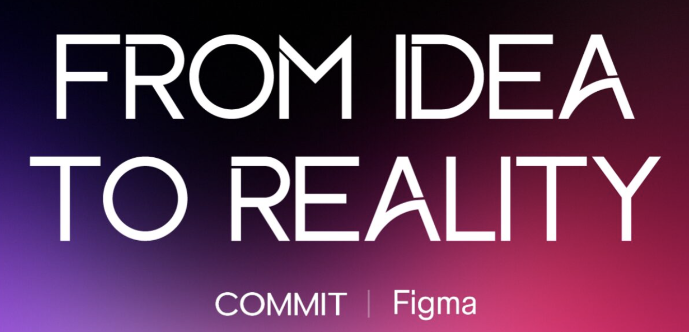

* 링크/신청: https://tech.goorm.io/2025_commit_figma/ (마감)
* 일시/장소: 11/13(목) 19시-22시, 구름스퀘어 강남 14층 타운홀
* 한줄설명: Figma VP of Product 및 전문가의 강연 및 데모 

## NVIDIA AI Day Seoul 

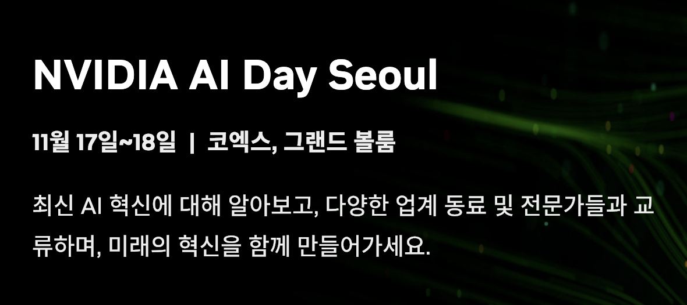

* 링크/신청: https://www.nvidia.com/ko-kr/ai-days/ (마감)
* 일시/장소: 11/17-18(월,화) 10시-18시, 코엑스 그랜드볼룸  
* 한줄설명: 첫날 DLI 워크숍(유료), 둘째날 AI Day Seoul 세션은 무료 

## Microsoft Ignite 2025 

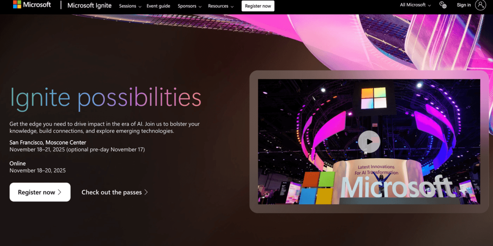

* 링크/신청: https://ignite.microsoft.com/en-US/home (신청)
* 일시/장소: November 18-20, 2025 (온라인), 18-21(오프라인), Online | San Francisco
* 한줄설명: 봄에는 Build, 가을에는 Ignite 

## JetBrains AI Meetup Seoul 2025

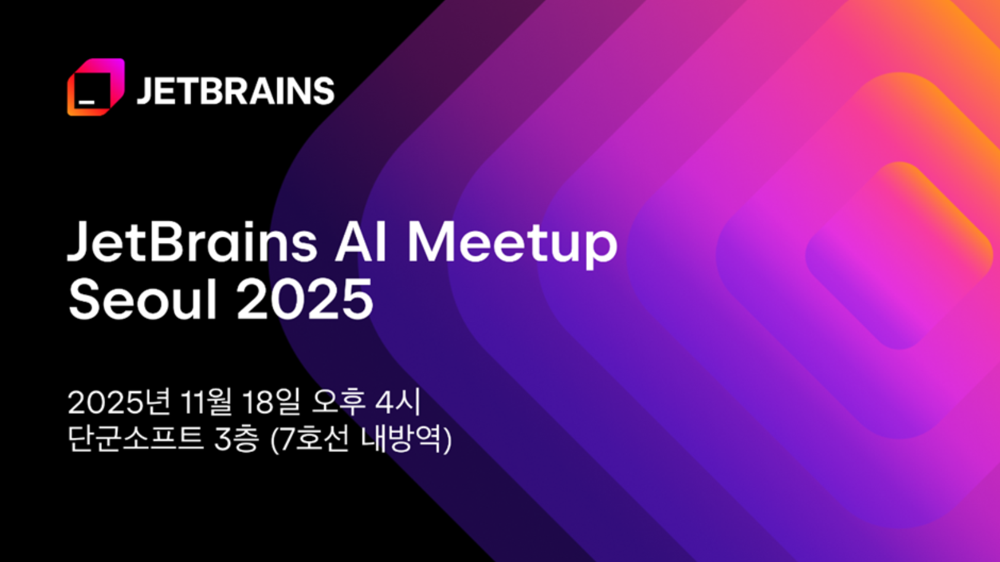

* 링크/신청: https://event-us.kr/tangunsoft/event/115657
* 일시/장소: 11/18(화) 16시-18시, 단군소프트 3층 세미나실
* 이상적인 AI 에이전트 활용, 멀티 에이전트 협업, 원격 AI 실행 등, JetBrains가 제시하는 IDE에서 AI 도구로 확장되는 새로운 개발 경험 공유 

## 트렌드클럽 미니컨퍼런스(AI활용사례, 스타트업얼라이언스)

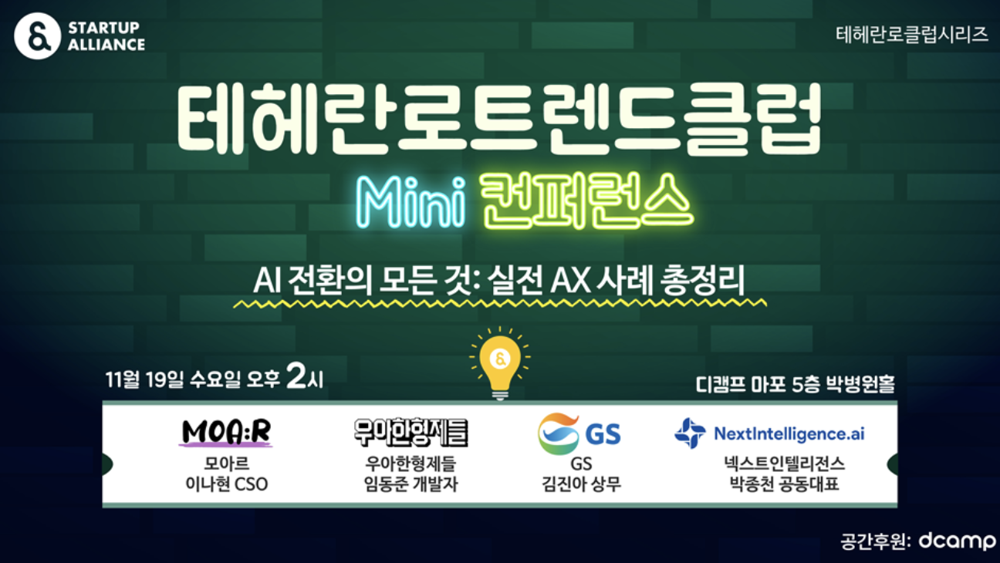

* 링크/신청: https://lnkd.in/gB-hKAus (신청)
* 일시/장소: 11/19(수) 14시-17시, 디캠퍼 마포(프론트원) 5층 박병원홀
* 한줄설명: 모아르, 우형, GS, 넥스트인텔리전스의 실전 AX사례 총정리

## <11월 COMMIT> [오프라인] 오늘부터 스타트업 개발자입니다: 서비스 설계에서 놓치기 쉬운 것들 (발표: 강대명) 

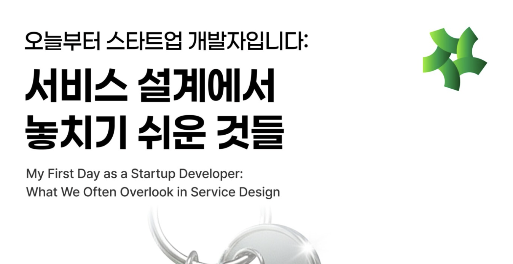

* 링크/신청: https://tech.goorm.io/2511_commit/ (신청)
* 일시/장소: 11/19(수) 19시-20:30, 구름 판교(PDC) 
* 한줄설명: 레디스 전문가 강대명님의 스타트업 서비스 설계 인사이트! 

## Samsung Tech Conference 2025 (삼성 테크 컨퍼런스 2025)

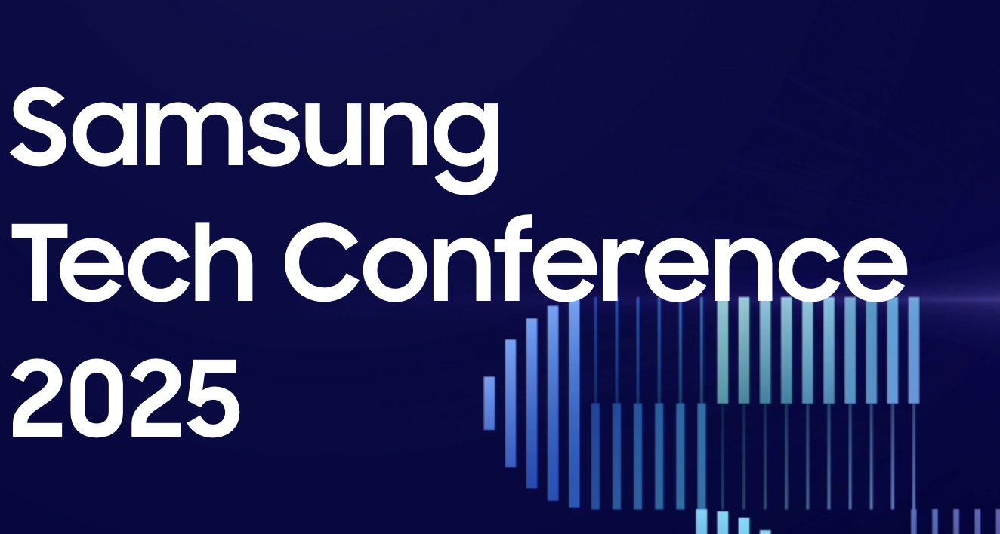

* 링크/신청: https://stckorea.com/ (신청)
* 일시/장소: 11/20(목) 10시부터, Online
* 한줄설명: 디지털 전환(DX)을 넘어 “인공지능 전환(AX)”이라는 새로운 패러다임속에서 다양한 지식과 경험 공유

## 토스 보안 컨퍼런스 GUARDIANS 25 

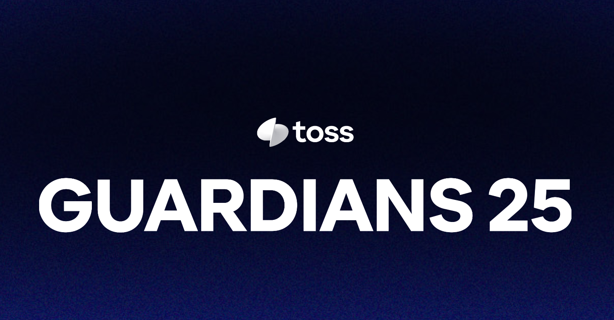

* 링크/신청: https://toss.im/guardians-25 (마감) 
* 일시/장소: 11/20(목) 오후 1시-6시, 코엑스 그랜드볼룸
* 한줄설명: 더 견고한 보안을 만들기 위한 토스팀의 이야기

## Let'Swift 2025

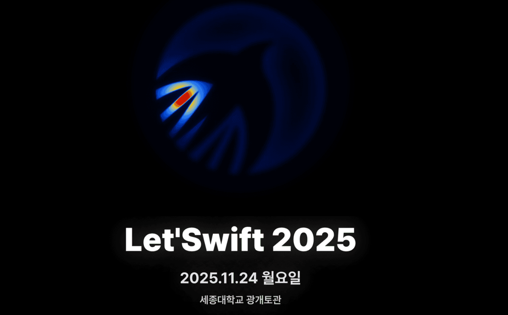

* 링크/신청: https://www.ticketa.co/events/35 (신청) 
* 일시/장소: 11/24(월), 세종대학교 광개토관 컨벤션센터 B, C
* 한줄설명: 'The' iOS 개발자 컨퍼런스, "Ember to Stars"

## 52g DAY - AI Experience (by GS)

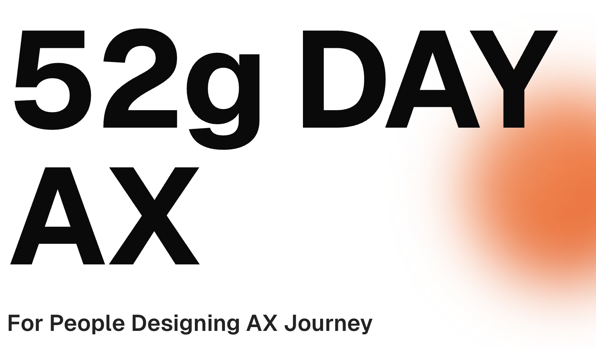

* 링크/신청: https://lnkd.in/gWf4Wa2c (신청) 
* 일시/장소: 11/26(수) 오후4시-8시, GS강남타워 25층 
* 한줄설명: GS그룹의 혁신조직인 52g의 AX 공유 행사, For People Designing AX Journey (2025년 589개 문제 발굴, 69개 프로젝트 진행)

# [2025년 12월]

## AWS re:Invent 2025 

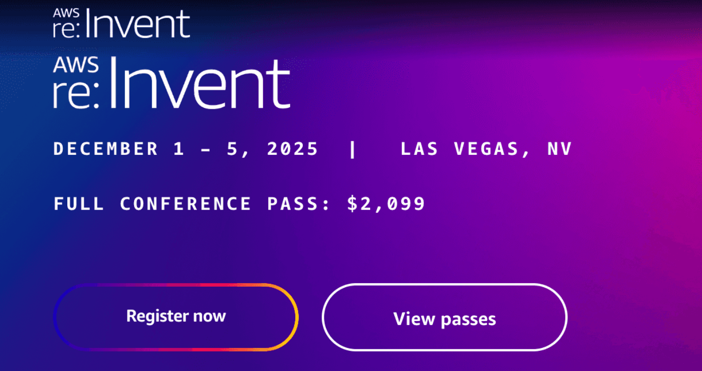

* 링크: https://reinvent.awsevents.com/
* 신청: https://registration.awsevents.com/flow/awsevents/reinvent2025/reg/createaccount 
* 일시/장소: Decemter 1 - 5, 2025 | Las Vegas
* 한줄설명: AWS(Amazon Web Services)의 대표적인 연례 기술 컨퍼런스

## NeurIPS 2025

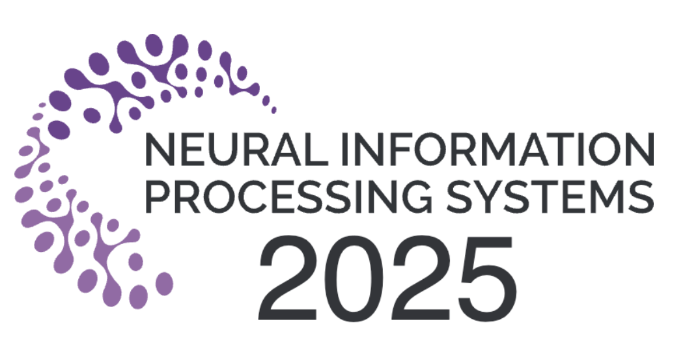

* 링크/신청: https://neurips.cc/
* 일시/장소: 12/2(화)-12/7(일), San Diego & Mexico City 
* 한줄설명: The Thirty-Ninth Annual Conference on Neural Information Processing Systems 

## GitHub Universe '25 Recap Seoul

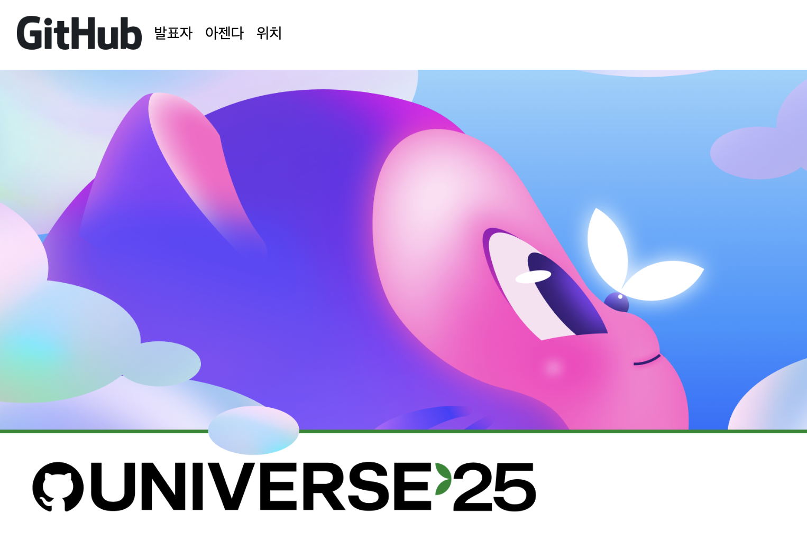

* 링크/신청: https://gh.io/recap25-sel3 (신청) 
* 일시/장소: 12/03(수) 오후1시-5시, 광화문 마이크로소프트
* 한줄설명: 지난 10월, 미국 샌프란시스코에서 열린 GitHub의 연례 개발자 컨퍼런스 'GitHub Universe'에서 발표된 주요 업데이트와 새로운 기능들을 한국어로 자세히 소개해 드립니다

## DevFest 2025 Incheon(송도)

* 링크/신청: https://www.ticketa.co/events/40 (신청)
* 일시/장소: 2025년 12월 6일(토) | 송도 컨벤시아
* 한줄설명: Google 기술 생태계를 중심으로 한 40개 이상의 세션과 다양한 실습 + [코드너머](https://product.kyobobook.co.kr/detail/S000216932006) 저자들의 북토크까지! 

## 모두콘 2025 (MODUCON 2025)

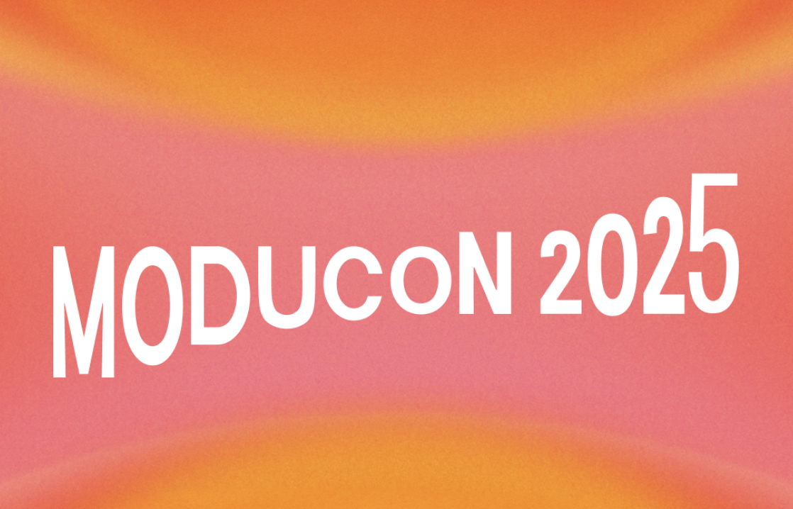

* 링크/신청: https://modulabs.co.kr/community/momos/424 (모집전, 11/11 현재) 
* 일시/장소: 12/13(토) 10시-17시 서대문로 이화여대길 52
* 한줄설명: From AI to Infinity, 300명 한정(선착순 신청)

## Instruct.KR 2025 12월 밋업 

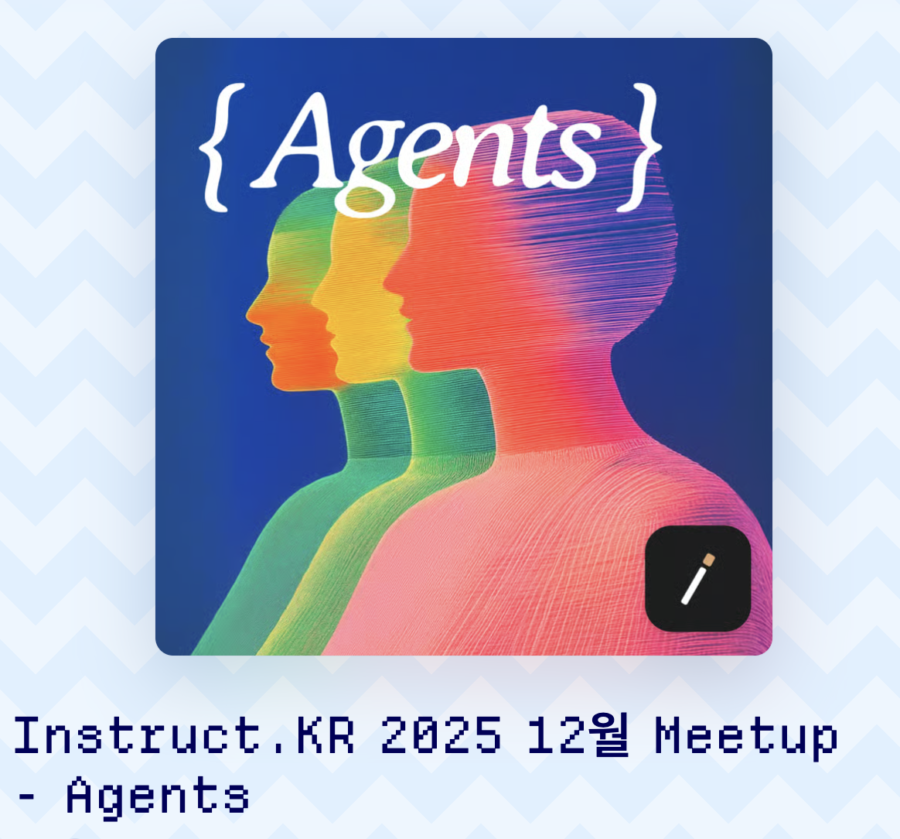

* 링크/신청: https://luma.com/sj78l1dz (신청) 
* 일시/장소: 12/20(토) 13시-19시, 월드 스페이스 서울 (종로구 삼일대로)   
* 한줄설명: ​Instruct.KR은 대한민국의 AI 연구자, 엔지니어, 프로덕트 팀을 위한 AI 리서쳐 및 실무자 중심의 커뮤니티

# [2026 1Q: 일정확정 행사]
2026년 일정이 확정된 행사는 아래의 해외 행사들입니다. 
 

## CES26 

* 링크/신청: https://www.ces.tech/ (신청)
* 일시/장소: January 6 - 9 (현지시간), Las Vegas, US
* 한줄설명: Innovators show up - 세계 최대 연례 가전 행사
* CES: Consumer Eletrtic Show 

## MWC26
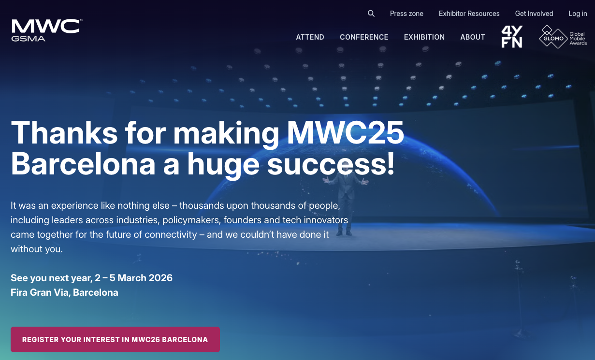

* 링크/신청: https://www.mwcbarcelona.com/ (신청)
* 일시/장소: 2 - 5 March 2026 (현지시간), Barcelona, Spain 
* 한줄설명: 세계 최대 연례 모바일 통신 행사 
* MWC: Mobile World Congress 

## NVIDIA GTC 2026
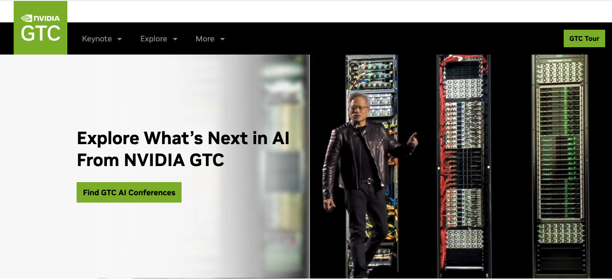

* 링크/신청: https://www.nvidia.com/ko-kr/gtc/ (신청)
* 일시/장소: 16 - 19 March 2026 (현지시간), San Jose, US 
* 한줄설명: 글로벌 최대 영향력, NVIDIA GPU 기반 AI 기술 로드맵과 인사이트 공유 
* GTC: GPU Technology Conference 

 

# 마무리하며

이 글을 쓰는 날짜 기준으로, 2026년 1월 1일까지 정확히 50일 남았네요!   
남은 시간 건강하게 한해 잘 마무리하시길 바랍니다. 

