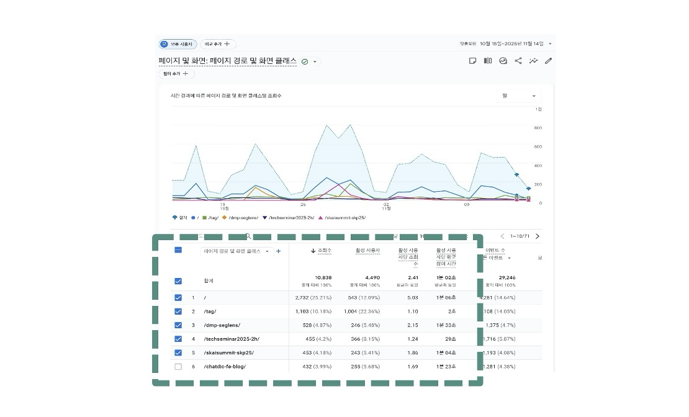
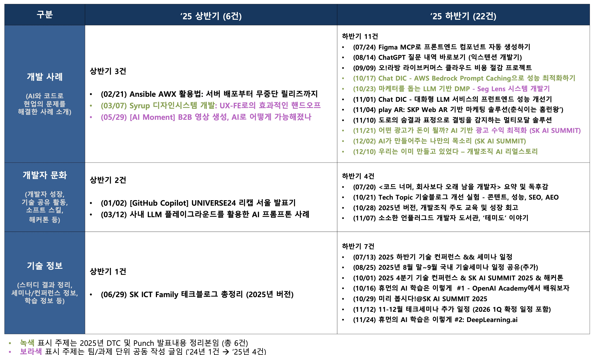

안녕하세요, 테크편집부입니다. 독자 여러분 새해 복 많이 받으세요!  
2026년 한 해 모두 건강하시고 각자의 위치에서 행복한 코딩 하시길 바랍니다 :) 

SK플래닛 기술 블로그 [**Tech Topic**](https://techtopic.skplanet.com/)이 2023년 1월 다시 문을 연 지 어느덧 3년이라는 시간이 흘렀습니다. 
(관련 글: [**'SK플래닛 Tech Topic 기술 블로그를 소개합니다!'**](https://techtopic.skplanet.com/skp-techblog-intro/) 참조)   
Tech Topic은 단순한 기술의 기록만이 아니라, SK플래닛의 기술 DNA를 외부 세계와 연결하고 이를 내재화하는 **회고의 여정** 을 담았다고 생각합니다. 또한 개발자 차원에서는 **퍼스널 브랜딩** 및 **성장 플랫폼**으로서의 역할도 수행하였는데요. 2026년 새해를 맞아, 지난 3년간의 유의미한 변화와 지표들을 숫자로 정리하며 앞으로의 방향을 함께 공유하고자 합니다. 

---

## (1) 양적 성장을 넘어선 꾸준함: 아티클 발행량 2배 증가 

Tech Topic은 2024년 상반기까지는 월 평균 1-2천 수준의 조회수를 기록하며 조용히 기반을 다져 왔습니다.  
그러다가 2024년 하반기부터는 AI 및 개발자 회고 중심의 아티클을 늘려 가면서 5-6천 수준으로 점진적 성장을 이룬 뒤, 2025년 7월 GA4(Google Analytics 4) 기반의 데이터 분석 결과를 토대로 대대적인 기술 블로그 개선을 단행하였습니다(관련 글: [**'Tech Topic 기술블로그 개선 실험 - 콘텐트, 성능, SEO, AEO'**](https://techtopic.skplanet.com/techblogupdate1/) 참조). 

* **꾸준한 발행**: 하반기부터 기고 글 수를 대폭 확대하며 매월 꾸준한 콘텐츠를 선보였습니다(10월·11월 각 7건 발행 등). 그 결과로 '24년 14건에서 **'25년 28건**으로 2배의 테크 아티클을 발행하였습니다. 

* **개발자 친화적인 콘텐츠 큐레이션**: '코드를 통해 현업의 문제를 해결하고자 하는' SK플래닛의 개발 사례를 포함하여, 기술 문화, 세미나 일정 및 교육 등의 기술 정보, AI 등으로 다양화하였습니다. 

* **사용자 경험(UX) 최적화**: 블로그 메인 배너 개편 및 로딩 속도 향상, 접근성(A11y) 강화, 그리고 SEO/AEO(검색 및 AI 답변 최적화) 개선을 통해 누구나 쉽게 기술 정보를 접할 수 있는 환경을 만들었습니다.

(성능, 접근성, 검색엔진 최적화 개선 결과)

 

---

## (2) 첫 이정표: 월간 조회수 10,000건 돌파 

추석 연휴 직후인 10월 15일부터 11월 14일까지 30일간, Tech Topic은 새로운 첫 이정표를 세웠는데요, 바로 **30일 PV 10,000+** 을 달성한 것입니다. 

* **콘텐츠 집중 발행 및 카테고리 다양화**: 한 달간 총 11개의 글을 발행하며 개발 사례(5건), 개발자 문화(3건), 기술 정보(3건) 등 풍성한 카테고리를 구성했습니다. 참고로 비슷한 시점에 진행되었던 SK AI SUMMIT 발표 주제의 정리 글은 이 기간 이후에 발행되었으며, 해당 기간 많은 개발자 분들이 참여해 주셔서 좋은 포트폴리오를 구성할 수 있었습니다. 이 자리를 빌어 감사의 인사를 드립니다 : )

* **첫 PV 10,000+ 달성**: 그 결과, 30일 조회수가 **10,838회**를 기록했습니다. 이는 특정 아티클에 의존한 일시적 현상이 아니라, 전반적인 품질 향상과 사용자 유입 경로 최적화가 함께 만들어낸 작은 열매라고 할 수 있습니다.  

---

## (3) 또다른 값진 의미: 개인에서 조직으로 - 협업의 문화를 반영한 기술 홍보 

숫자의 증가보다 더 의미있는 숨은 가치는 바로 **기고 스타일의 변화**였습니다. 개발자 개인 차원의 기고를 넘어, 팀이나 과제 단위(2인 이상)로 참여하는 글의 비중이 전년 대비 높아졌습니다. 

* **팀/과제 홍보 및 협업 기반 기고**: 2024년 단 1건이었던 팀 단위 글이 2025년에는 4건으로 증가했습니다(아래 참조). 
* **의미 있는 변화**: 이는 단순히 기술력을 홍보하는 차원 외에도, **팀 내 지식 공유 문화 정착 및 공동의 성과를 기록하려는 시도**가 시작되었음을 시사합니다. 과제의 기획부터 개발, 트러블슈팅에 이르기까지 전체 과정을 함께 조망하고 회고함으로써 콘텐츠의 깊이뿐만 아니라 그 가치가 더욱 의미를 가지게 되었다고 생각합니다. 

 

---

## 마치며: 다음 3년을 향하여 

Tech Topic의 지난 3년이 [README](https://web.archive.org/web/20190116065552/http://readme.skplanet.com/)에서 다시 오픈한 SK 플래닛 기술 블로그의 정체성을 재확인하고 기틀을 잡는 시기였다면, 앞으로의 3년은 **기술정보 전달 기능을 넘어 기술 홍보의 지속 가능성을 고민하는 시간**이 될 것입니다. 

국내 최고 수준인 SK데보션 등의 규모에는 비할 바가 아니지만, Tech Topic은 이미 **SK스퀘어 자회사 중 가장 활발하게 운영되고 있는 기술 채널로 자리매김하였습니다**. 단순한 조회수를 넘어, 회사의 발전과 함께 SK플래닛의 개발 활동을 알리는 홍보 채널이자 개발자들의 퍼스널 브랜딩과 회고를 돕는 플랫폼으로서 앞으로도 **SK 테크 문화의 한 축**을 지탱해 가고자 하오니 앞으로도 잘 부탁드립니다. 

읽어 주셔서 감사합니다! 