본 글에서는 SK 플래닛의 Data Lake이자 빅데이터 플랫폼인 DIC(Data Integration Cluster)에서 진행한 데이터 리드 타임 단축을 위한 실시간 데이터 전달 강화 과제를 소개하고자 합니다.
이 프로젝트에서는 스트림 데이터의 실시간 처리와 오픈소스 Trino를 전사 데이터 분석 엔진으로 활용하여 데이터 전달 시간을 획기적으로 줄였습니다.
따라서 이번 글에서는 Trino를 활용한 전사 데이터 분석 및 조회 시스템 구축 사례에 대해 자세히 설명하고자 합니다.

## 들어가며

SK플래닛은 고객에 대한 깊은 이해를 바탕으로 데이터 기반의 다양한 서비스를 개발하며 차별화된 가치를 제공하기 위해 2014년부터 전사적으로 서비스 데이터를 통합해 왔습니다. 이를 위해 회사의 모든 정보를 On-Premises 환경의 Hadoop 클러스터로 통합하였으며, 로그 및 실시간 데이터는 Kafka 클러스터를 통해 처리 후 Hadoop에 저장됩니다. 이렇게 통합된 자료를 효과적으로 분석하고 활용하기 위해, Hadoop Eco 기반의 오픈소스 솔루션과 Data Infrastructure 팀이 자체 개발한 도구들을 사내 여러 부서에 제공하고 있습니다. 아울러 데이터 처리와 분석 작업을 보다 유연하게 수행하기 위해 Kubernetes 클러스터를 구축하여 활용 중입니다.

이러한 솔루션들은 회사 내부적으로 DIC(Data Integration Cluster)라고 불리며, 데이터를 적재하고 활용할 수 있는 통합 환경을 제공하는 다양한 웹 및 WAS 시스템으로 구성되어 있습니다. 현재 SK플래닛의 전 구성원 중 20% 이상이 이 시스템을 적극 활용하고 있으며, 주요 서비스 분석, 인사이트 도출, 마케팅 및 타겟팅 활동에 중요한 역할을 담당하고 있습니다. 특히 DIC는 실명 기반 마케팅과 비실명 기반 타겟팅 광고에도 필수적인 기능을 수행하고 있습니다.

## 기존 데이터 흐름 구조

빅데이터 플랫폼인 DIC에 입수되는 데이터는 크게 3가지 종류로 구성됩니다. 

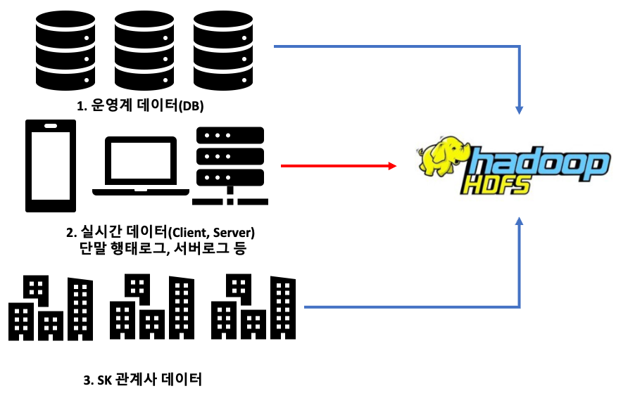

이 중 사내 데이터는 다음의 두 가지 유형으로 구분됩니다.

#### (1) 운영계 데이터

이 데이터는 주로 RDBMS(예: MySQL, Oracle)로 관리되며, Hadoop 클러스터의 HDFS(Hadoop Distributed File System)에 복제되어 저장됩니다. 운영계 데이터는 일별 또는 시간별로 주기적으로 스냅샷 형태로 HDFS에 적재됩니다. 이러한 방식으로 정기적으로 적재하는 이유는 과거와 현재 데이터를 쉽게 비교할 수 있어 데이터 분석에 유리하기 때문입니다.

HDFS는 데이터를 추가하는 형태에 적합하므로, 운영계 데이터는 업데이트보다는 새로운 정보를 계속 쌓아가는 구조로 관리됩니다. 이는 사내 전체 데이터의 약 80%를 차지합니다.

#### (2) 실시간 데이터

이 데이터는 사내 서비스에서 수집된 사용자 로그 데이터를 의미하며, 실시간으로 수집되어 즉시 분석과 처리가 가능합니다. 이를 위해 각 애플리케이션에는 데이터 수집을 위한 SDK(Rake)가 설치되어 있으며, 이 정보를 실시간으로 Kafka로 전송합니다.

또한, 서버에서 직접 전송되는 데이터(Rake Kafka)와 로그(LogAgent) 정보도 실시간으로 Kafka로 전송됩니다. Kafka에 적재된 데이터는 별도의 처리 시스템(Router)을 통해 즉시 HDFS로 적재됩니다. 실시간 데이터는 사내 전체 데이터 중 약 20%를 차지합니다.

## 운영계 데이터의 수집 방식

운영계 데이터는 Dump 형태로 HDFS에 적재됩니다. 이러한 구조적 특성으로 인해 주로 하루 전 데이터만을 참조하게 되며, 이는 불필요한 데이터 공간 낭비를 초래합니다.

특히 용량이 큰 테이블의 경우, 데이터 입수 및 적재 과정에서 많은 리소스를 소모하게 됩니다. 만약 이 데이터가 클라우드를 통해 관리된다면, 데이터 전송 비용이 추가로 발생하여 실질적인 비용 증가로 이어질 수 있습니다.

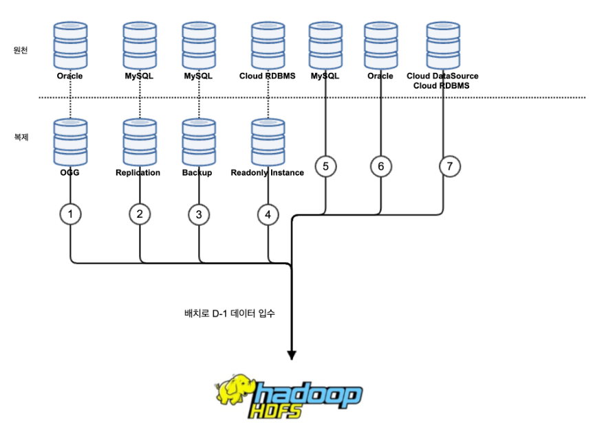

운영계 데이터가 빅데이터 플랫폼인 분석계에 적재되는 형태는 위 그림과 같이 표현할 수 있습니다.

정리하면, 이 구조는 다음과 같은 장단점이 있습니다. 

#### 장점
* Snapshot 데이터 적재로 과거와 현재의 데이터 비교 분석에 유리
* 데이터의 변경점을 별도로 관리할 필요가 없음(PK값 불필요)
* Hadoop Eco의 Sqoop을 통한 분산 처리로 HDFS 적재 가능
* 데이터 통합에 유리하며, 모든 데이터가 HDFS로 이동되어 상호/교차 분석에 용이

#### 단점
* 하루 전(D-1) 데이터가 자정부터 HDFS에 적재되어 Data Freshness 감소
* 대용량 데이터 이동에 리소스 과다 소모(비용/시간 증가)
* Hadoop HDFS 공간의 비효율적 활용(중복)
* 입수 장애 시 연결된 배치 작업에도 영향

요약하면, 이 방식은 데이터 통합과 상호/교차 분석에 유리하나, 실시간 분석과 활용이 필요할 때 한계가 있습니다. 또한, 일부 대용량 데이터 활용 시 리소스가 비효율적으로 소모되는 특징이 있습니다.

이러한 단점을 해결하기 위해 다음과 같은 방법을 사용하고 있습니다.
* 불필요한 데이터에 대한 보관 주기 적용 및 과거 스냅샷 자동 삭제
* 대용량 데이터에 대한 증분 입수 또는 시간 단위 데이터 입수 적용

그러나 현재 데이터 흐름 구조상 데이터 생산 시간의 지연과 데이터 활용 시 실시간성 저하 문제는 해결이 어려운 상황입니다.

데이터 조회 환경은 다음과 같이 표현할 수 있습니다.

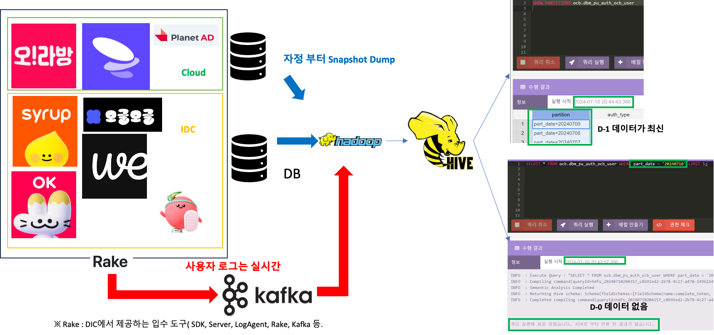

그림 우측은 사내 분석 시스템을 통해 데이터를 조회하는 과정을 보여줍니다. D-1 데이터가 항상 최신이며, D-0 데이터는 조회가 불가능한 것을 확인할 수 있습니다. 실시간 클라이언트 행태 로그는 즉시 확인이 가능하지만, 80%의 운영계 데이터는 그림과 같이 실시간 조회가 불가능합니다.

이러한 구조는 대부분의 Data Lake에서 유사할 것으로 예상되며, 특히 대규모로 데이터를 통합한 플랫폼에서 자주 발생하는 문제입니다. 

이러한 한계를 극복하기 위해, Data Lake 아키텍처는 실시간 처리와 분석 기능을 강화하는 방향으로 발전하고 있습니다. 최근에는 Data Mesh와 Data Fabric 같은 개념이 주목받고 있으며, 이들은 데이터 접근성을 높이고 운영계 데이터와 실시간 데이터를 통합하여 보다 효율적이고 신속한 분석을 가능하게 합니다.

이러한 개념들은 다양한 오픈소스와 기술을 활용하여 구현되고 있습니다.

* Data Mesh는 데이터의 소유권을 분산시켜, 각 도메인 팀이 데이터를 관리하고 운영할 수 있도록 함으로써 보다 유연하고 확장 가능한 데이터 아키텍처를 제공합니다.
* Data Fabric은 다양한 데이터 소스 간의 연결성과 통합성을 강조하며, 데이터 관리 및 접근을 자동화하고 표준화합니다. 이를 통해 데이터 소비자가 필요한 데이터를 언제 어디서나 쉽게 접근하고 사용할 수 있는 환경을 조성하는 것을 목표로 합니다.

SK 플래닛은 이러한 개념들 중에서도 **통합된 환경에서 필요한 데이터에 손쉽게 접근하고 활용할 수 있는 환경**을 조성하기 위해 Data Fabric 개념을 참고하여 아키텍처를 설계하였고, 지속적으로 개선하고 있습니다.

따라서 현재의 구조를 더욱 발전시킬 필요성을 인식하고 있으며, 더 나은 구조를 위한 고민을 계속해서 이어가고 있습니다.

## 적재한 데이터를 조회하는 구조

HDFS에 저장된 데이터 분석을 위해 Hadoop 생태계에서는 주로 MapReduce, Hive, Spark 등의 오픈소스 엔진을 사용합니다. 이들은 분산 처리와 저장에 특화되어 있습니다.

이러한 분산 처리 엔진들은 대용량 데이터 처리에 강점이 있지만, 일반적인 RDBMS나 NoSQL 기반 서비스용 DB와는 특성이 다릅니다.

DIC라는 빅데이터 플랫폼을 Hadoop 생태계로 구축하고 운영하면서 자주 받는 질문 중 하나는 "데이터 조회 속도가 기존 DB보다 느리다"는 것입니다.

그러나 데이터 조회 속도는 데이터 용량에 따라 달라집니다. 특히 빅데이터의 경우, Hive와 같은 분산 처리 엔진이 오히려 안정적이고 빠른 성능을 보일 수 있습니다. 예를 들어, 1억 건 이상의 데이터 탐색과 분석 시 분산 처리 환경이 더 효과적입니다.

분산 처리 엔진이 대용량 데이터 처리에 효율적이지만, 실제로 사용자가 조회하는 모든 데이터가 대용량인 것은 아닙니다. 사내 분석 시스템에서는 수행 시간이 30초 이하인 탐색형 쿼리나 간단한 쿼리가 많습니다. 따라서 소용량 데이터 처리를 위해 Hive 외의 대안도 고려해야 합니다.

이 문제 해결을 위해 빅데이터 오픈소스 진영에서 새로운 기술을 지속적으로 검토하고 있습니다. 특히 Facebook이 2008년 Hive를 공개한 이후, Hadoop 프로젝트에 편입되면서 다양한 오픈소스가 등장했습니다.  

Hadoop 생태계에 전문성을 가진 기업들은 이러한 소프트웨어를 다양한 환경에서 활용하고 있습니다. SK 플래닛도 데이터의 용량과 속도에 맞춰 여러 엔진을 시스템에 적용하고 있습니다.

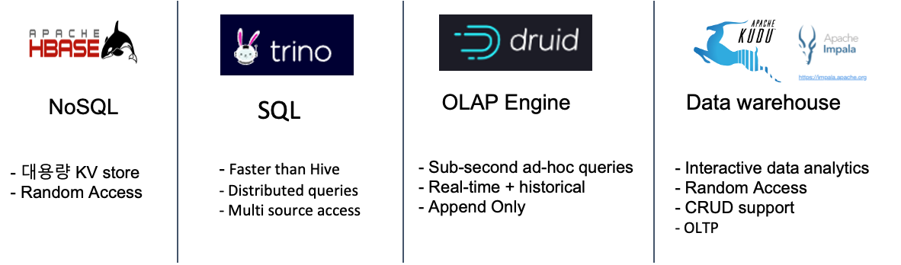

대용량 데이터의 UPSERT와 랜덤 액세스를 위해 HBase와 Phoenix를 사용하며, 내부 인사이트 리포트 생성 및 동적 모수 추출에는 Impala와 Kudu를 활용합니다. 빠른 집계 처리가 필요한 경우 Druid를, 이종 데이터베이스 간 조인 작업에는 Trino를 사용합니다.

그러나 메인 엔진과 데이터 분석가들의 SQL 환경은 여전히 Hive를 통해 운영됩니다. 다른 엔진들은 성능 극대화를 위해 HDFS 데이터 재적재나 추가 하드웨어 자원이 필요할 수 있어, 메인 분석 엔진으로 사용하기에는 한계가 있습니다.

따라서 메인 엔진으로 Hive 이외의 대안을 모색할 필요성이 대두되고 있습니다.

## 데이터 관리의 한계를 극복하기 위한 아이템 도출

운영계 데이터 적재 구조로 인한 지연을 방지하고 조회 성능을 효율적으로 구성하기 위해 오픈소스 엔진인 Trino를 선택했습니다.

SK 플래닛은 2019년에 이종 DB 간의 조인 데이터 추출을 가속화하기 위해 Presto를 도입했습니다. 그러나 2021년 엔진 업데이트 과정에서 여러 문제가 발생했습니다. 예를 들어, 연동 JDBC 라이브러리의 호환성 이슈로 일부 기능이 동작하지 않았고, CTAS 쿼리(CREATE TABLE AS SELECT)가 정상적으로 실행되지 않았습니다.

이러한 문제를 해결하기 위해 오픈소스 커뮤니티를 검토한 결과, PrestoDB에서 포크된 PrestoSQL이 Trino라는 이름으로 리뉴얼되었고, 다양한 버그가 수정된 것을 확인했습니다. 이에 따라 SK 플래닛은 2021년에 Presto에서 Trino로 사내 시스템의 엔진을 변경했으며, 사내 개발자들을 대상으로 기술 공유 세션도 진행했습니다.

SK 플래닛은 Trino를 단순히 일부 데이터 조회 엔진으로 사용하는 데 그치지 않고, 전사적으로 데이터에 접근할 수 있는 환경을 구축하고 이를 개방하는 것을 목표로 설정했습니다. Trino를 통해 실시간 데이터 분석 및 조회 환경을 구축함으로써 데이터 활용의 효율성을 극대화하고자 했습니다.

Trino의 주요 특징은 다음과 같습니다:

1. 다양한 Data Source에 연결 가능
2. 연결된 Data Source를 단일화된 SQL 문법으로 접근
3. 이종 DB 간의 데이터를 융합/분석 가능

Trino의 최대 장점은 다양한 데이터의 마이그레이션/적재 없이 연결만으로 데이터 활용이 가능하다는 것입니다. 오픈소스의 특성상 수많은 Data Source 연결 Connector가 공개되어 있으며, Cloud나 On-premises의 다양한 DB와 Data Source의 연동이 가능합니다.

이러한 특징 덕분에 최근의 데이터 플랫폼들은 일부 데이터 연결만으로도 통합된 분석 환경을 지원하고 있습니다. 또한 Trino 자체의 Pushdown 기술을 활용해 효율적인 데이터 인프라로 활용할 수 있습니다.

Trino는 국내외에서 많이 사용되고 있으며, 기업형으로 적용하기 위한 "Starburst"라는 솔루션이 있습니다. 이 솔루션은 오픈 소스인 Trino의 부족한 부분을 보완하며, 추가적인 기능들을 제공합니다.

## Trino를 활용한 사내 시스템 구축에 필요한 것들

SK플래닛은 Trino를 기업형으로 활용하기 위해 오픈소스 기반의 사내 시스템 구축을 결정했습니다. 이는 자체적인 빌드 및 구축 역량, 효율적인 인프라 구성 필요성, 그리고 Apache 기반 Hadoop 구축 경험 등을 고려한 결정이었습니다.

전사 분석/조회 환경에 필요한 아이템을 선정하고, 이를 기반으로 시스템을 개발하여 다음과 같은 문제들을 해결했습니다:

#### 1. Trino의 SPOF 기능 부재 해결을 위한 HA 적용

Trino는 기본적으로 HA(High Availability) 기능을 지원하지 않아, Master(Coordinator)가 단일 서버에 구성되어 해당 서버 다운 시 전체 클러스터 이용이 불가능합니다. 이 문제를 해결하기 위해 Trino Gateway 오픈소스 프로젝트를 활용했습니다(https://github.com/trinodb/trino-gateway).

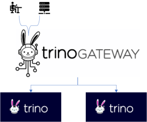

Trino Gateway는 lyft(미국 모빌리티 회사)가 개발한 후 오픈소스화한 프로젝트로, 클러스터 이중화를 구현하여 엔진 업그레이드 및 장애 상황에 안정적으로 대응할 수 있게 해줍니다.

#### 2. 안정적인 Trino 운영을 위한 모니터링 및 빌드 운영 환경 개발

오픈소스 기반 운영을 위해 자체 개발 및 구축한 도구들:
- Trino Configs: 환경설정 도구로 신규 버전 빌드, 테스트, 배포 관리
- 버전 업그레이드: 사내 bitbucket, jenkins를 통한 소스코드 관리 및 빌드
- 배포: Jarvis(SK 플래닛 배포시스템)를 통한 시스템 배포

모니터링은 다음 두 가지 항목으로 운영됩니다:
- Trino 클러스터 모니터링
- 연동된 Data Source 모니터링

이러한 시스템 상태는 Elasticsearch Cluster에 적재되어 Grafana를 통해 시각화됩니다. 이상 상황 발생 시 사내 메일이나 메신저(Teams, Slack 등)를 통해 자동 알림이 전달되어 신속한 대응이 가능합니다.

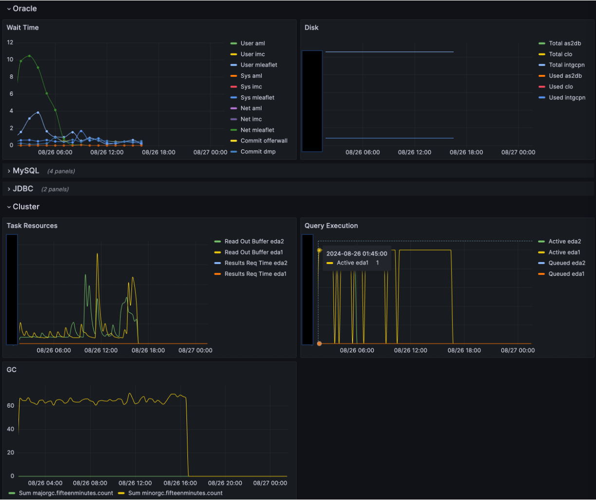

#### 3. Trino의 데이터 접근 권한 제어

전사 구성원의 약 25%가 빅데이터 플랫폼을 사용하고 있어, 강화된 데이터 보안과 안정적인 접근제어 시스템이 필요했습니다. 이를 위해 Apache Ranger와 권한 생성/관리 시스템을 새롭게 개발했습니다. 

모든 권한은 사내 LDAP 시스템과 연동된 QueryCache 시스템을 통해 제어 및 관리됩니다. 기존 Hadoop3의 권한제어를 위한 Ranger는 자체 개발한 Rangerbox 시스템으로 관리되며, Trino 접근제어를 위해 새로운 모듈도 개발했습니다.

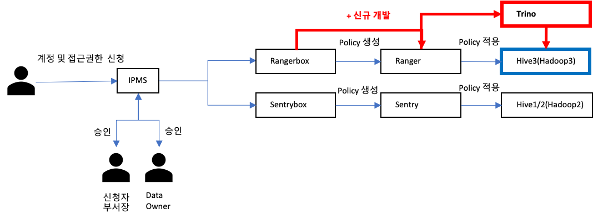

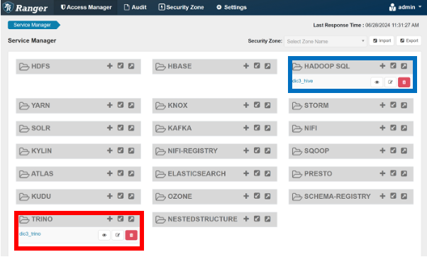

권한 생성 시 Trino에 연동된 테이블 구조는 사내 입수관리 통제 시스템인 Sentinel과 연동되어, 데이터 입수 요청과 관리를 자동화했습니다. 이 정보는 항상 최신 상태로 동기화됩니다.

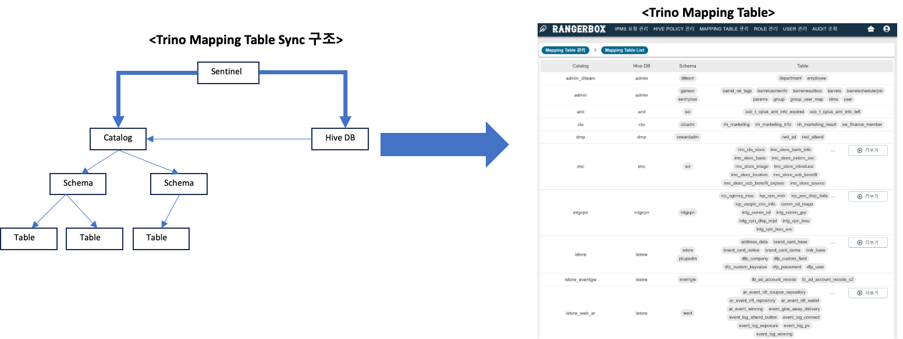

#### 4. Trino 사용을 위한 사용자 접근 도구: QueryCache, Galleon

사용자들은 기존 Hive 엔진 사용 방식과 유사하게 QueryCache와 Galleon 시스템을 통해 데이터에 접근할 수 있습니다. QueryCache는 JDBC, Shell, Library를 제공하며, Galleon은 SK 플래닛의 웹 기반 SQL Editor입니다.

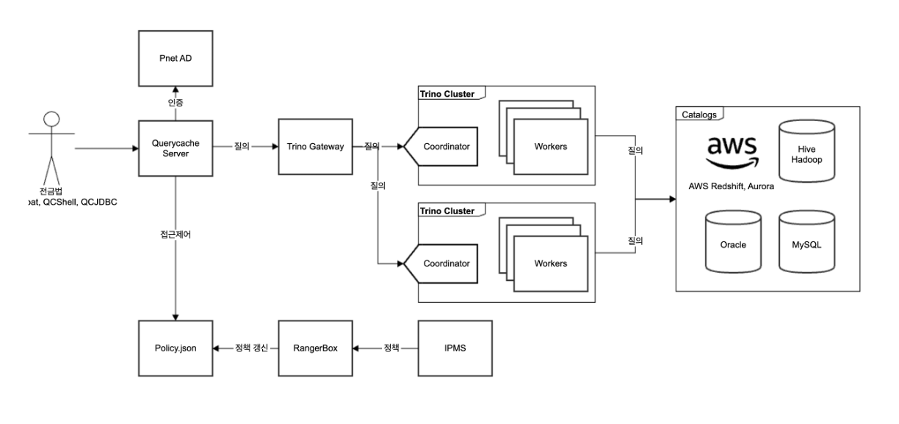

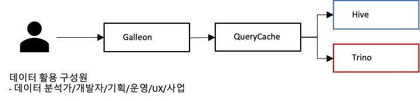

기존 시스템에 Trino 엔진을 추가하여 사용자 경험의 일관성을 유지했습니다. 사용자들은 기존 쿼리를 Trino 엔진으로 변경하여 실행함으로써 연동된 모든 데이터를 쉽게 활용할 수 있습니다.

#### 5. Trino에서 Data Catalog 개발

기존 Hive 는 Metastore 가 존재하며, 이를 활용한 Data Catalog를 SK 플래닛에서 제공하고 있습니다. 다만 Trino는 별도로 Metastore를 보유하고 있지 않아서 데이터 탐색시 필요한 Catalog가 존재하지 않습니다. 이것은 데이터 분석시, 데이터 탐색에 발생하는 비용을 증가시키며,Trino 와 Hive 간의 테이블 명이 다르고 명명 규칙도 달라 분석에 여러가지 어려움이 있습니다.

이러한  문제를 해결하기 위해 Trino의 Catalog 명과 Hive DB 명을 일부 통일시켜서  Catalog 명에 대한 정의를 다시 진행했습니다.

그 이후 Trino 메타스토어를 자체 구축하여, 사내 Data Catalog 시스템에 Trino 메타 정보조회 기능을 추가로 개발하였습니다.

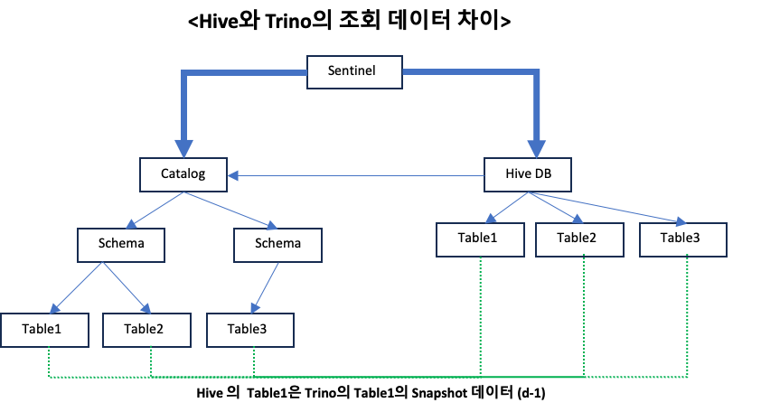

Hive DB와 Trino Catalog의 명명 규칙은 다음과 같습니다:

#### 연결된 DBMS 가 1개인 경우
* Hive DB 명을 그대로 사용(예: livecm, intgcpn, uptn_wallwet, wezuro 등)

#### 연결된 DBMS 가 2개 이상인 경우
* 가장 많은 Table을 보유 중인 DB 명 = Hive DB 명
* 이외 연결된 테이블의 서비스 특성 고려하여, postfix  추가(예: ocb, ocb_nft, ocb_ogeul)

위와 같은 이름 규칙에 따라 기존 Hive SQL 과 Trino SQL 은 다음과 같은 차이가 있습니다.

#### Hive 엔진

* SELECT * FROM {HiveDB}.{HiveTable}

#### Trino  엔진

* SELECT * FROM {TrinoCatalog}.{Schema}.{Table}
* SELECT * FROM di_hive.{HiveDB}.{HiveTable} (Hive에 있는 데이터 조회시)

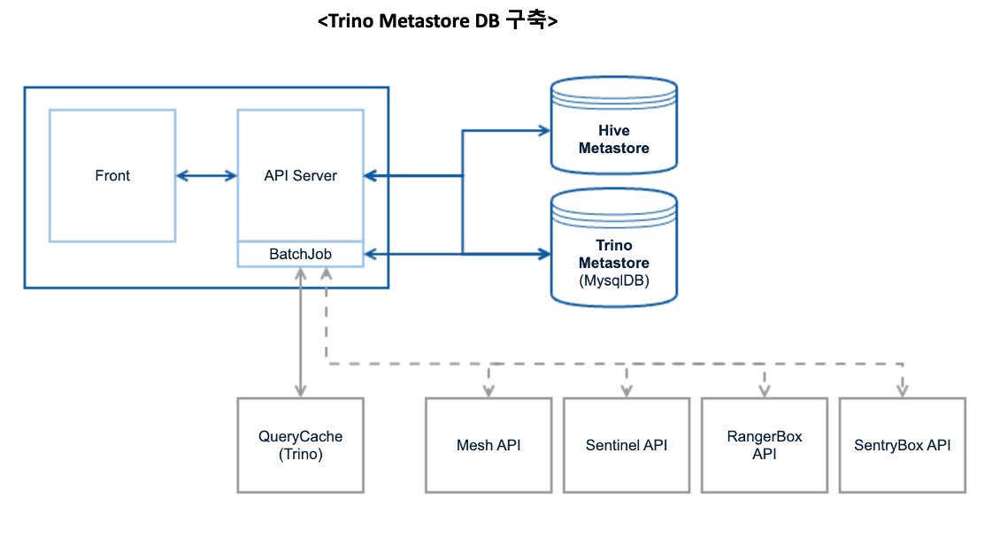

Trino에 연동된 모든 데이터는 일 배치 형태로 주기적으로 메타스토어와 연동되며, 이를 통해 Trino 메타데이터도 함께 검색할 수 있습니다.

SK 플래닛의 데이터 사용자들은 사내 Data Catalog 시스템인 MeDic(Metadata Dictionary)을 통해 Trino에 연동된 테이블 정보를 검색할 수 있습니다. MeDic은 기존 Hive 데이터(Hadoop)에 대한 메타 정보 검색 기능에 Trino 메타 정보 검색 기능을 추가하여 확장되었습니다.

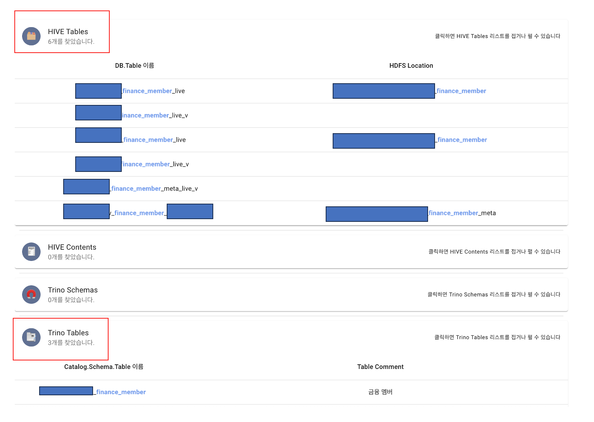

#### 6. 전사 운영계 DB의 Replication & Backup DB의 Trino 연동

Trino를 통해 전사 데이터에 접근하기 위해 기존 데이터 입수에 활용되던 운영계 DB, Backup DB 등을 활용했습니다. 효율적인 구조를 위해 일부 데이터를 통합하고, MySQL의 경우 보안적인 구성을 해결하기 위해 Proxy를 활용하여 신규 구축하였습니다.

결과적으로 7개 형태의 데이터 입수 구조가 5개로 일원화되었습니다. 이를 통해 전사의 운영계 데이터를 실시간으로 Trino를 통해 조회하고 분석할 수 있게 되었습니다.

## Trino 도입 후 데이터 활용 변화

모든 필요한 기능을 개발하고 전사 데이터 사용자들에게 해당 시스템을 공개했습니다. 그 결과, 데이터 분석 환경이 다음과 같이 변경되었습니다.

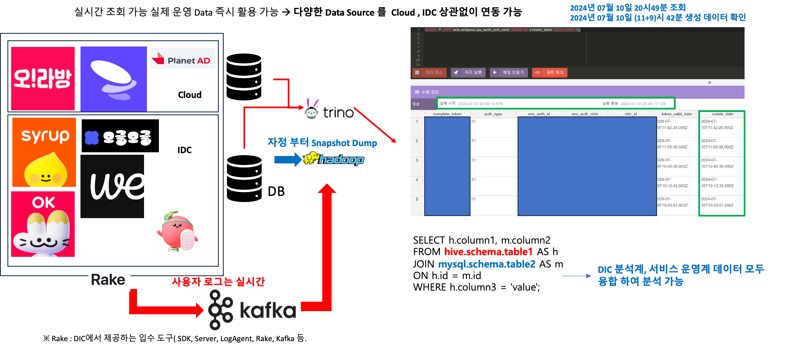

그림에서 볼 수 있듯이 데이터 조회 및 분석 시 실제 운영계 데이터에 대한 실시간 분석이 가능해졌습니다. 또한 조회 성능도 일부 개선되어, 적은 양의 데이터의 경우 Hive보다 더 빠른 성능으로 데이터를 활용할 수 있게 되었습니다.

[표 1: Rows별 각 시스템의 처리 시간]
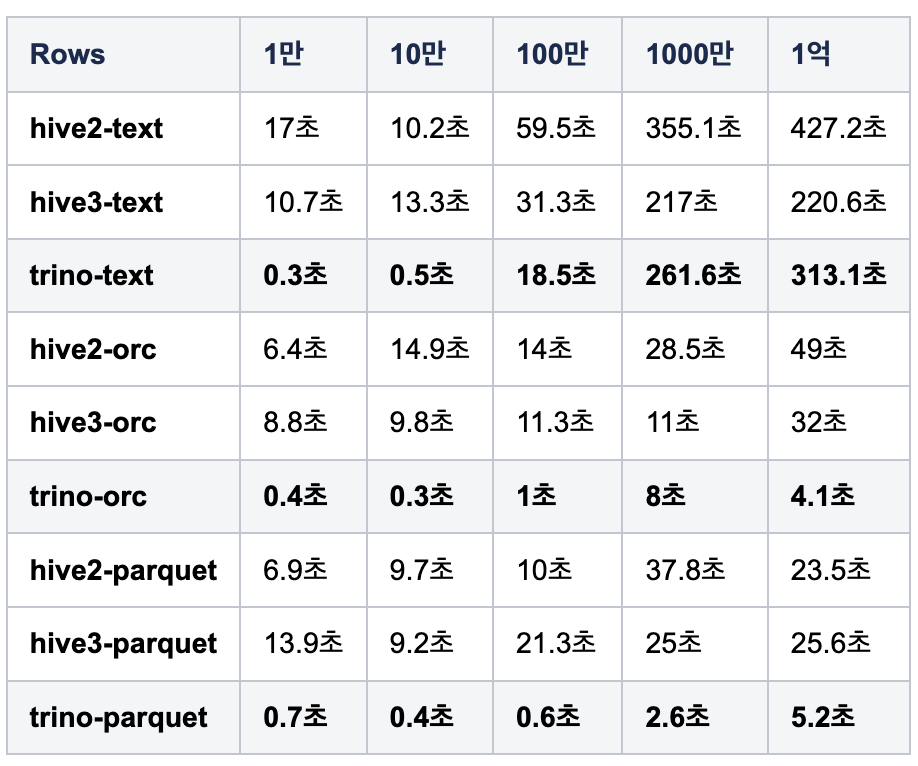
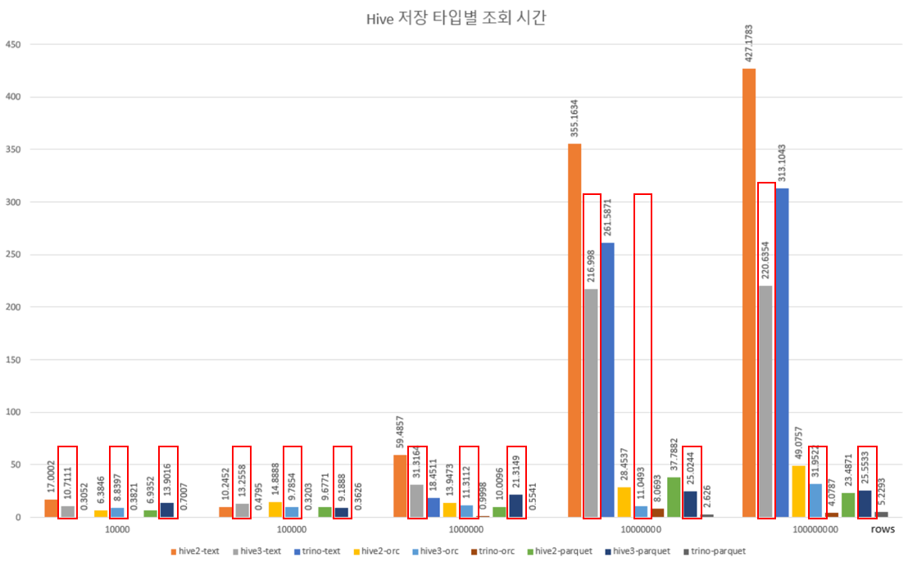

위 표와 그래프를 보면 알 수 있듯이 Trino는 적은 양의 데이터에서 기존 Hive보다 더 빠른 속도를 보장합니다. 경험적으로 1,000만 Rows 미만의 Text 데이터 처리에는 Trino가 적합하다는 것을 확인할 수 있었습니다. 

## 결론

본 과제를 통한 시스템 도입으로 사내 서비스의 DAU(일일 활성 사용자) 분석이 한층 정교해졌으며, 이를 통해 빠르고 효율적인 마케팅 집행과 신속한 의사결정이 가능해졌습니다. 또한 일부 리포트의 주기를 일간에서 시간 단위로 단축하는 성과를 거두었으며, 실시간 모수 추출에도 효과적으로 활용되고 있습니다.

SK플래닛은 이 시스템을 기반으로 다양한 서비스 적용 사례를 지속적으로 발굴하고 구체화해 나가고 있습니다. 더불어 이러한 데이터를 AI 환경에서 최적화된 방식으로 활용할 방안을 적극적으로 모색하고 있습니다. 감사합니다. 