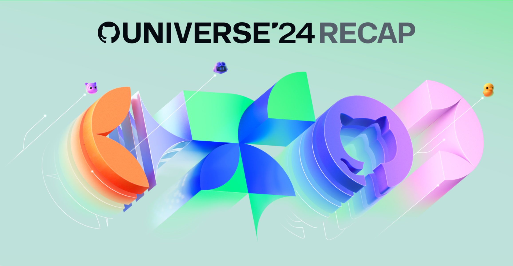
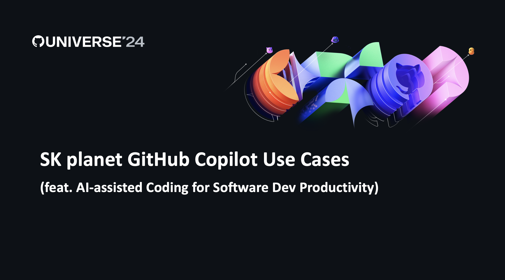
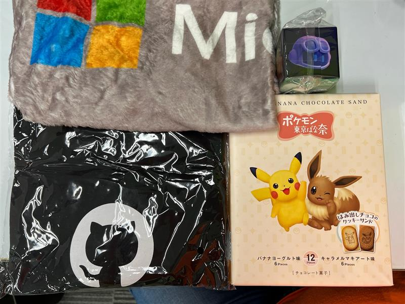
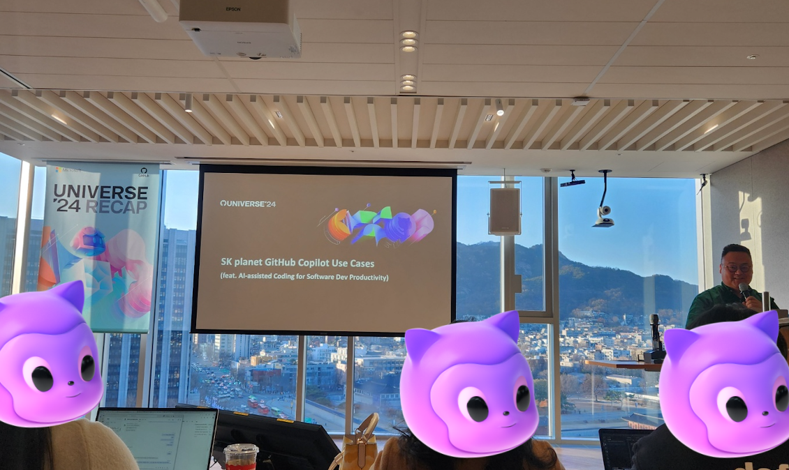
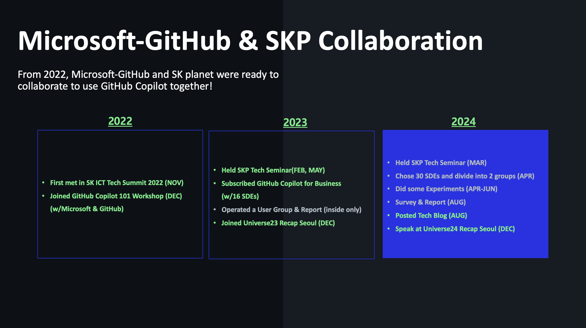
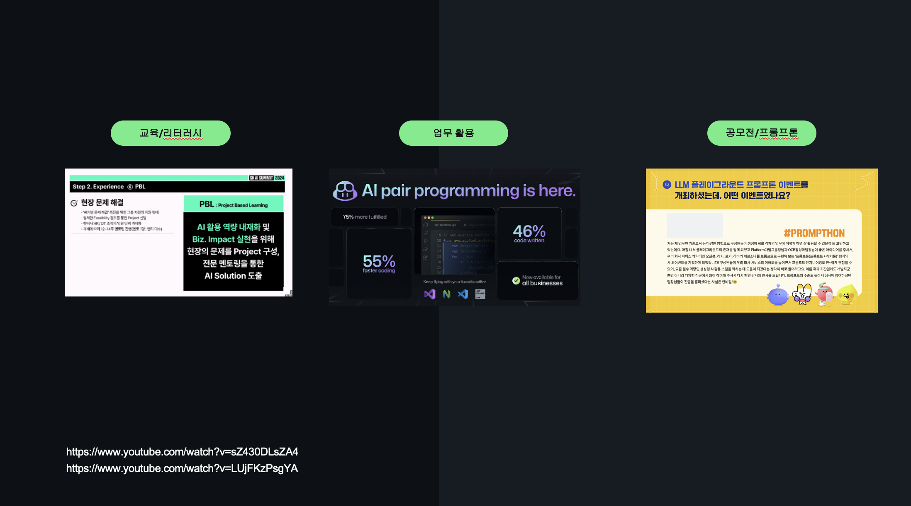
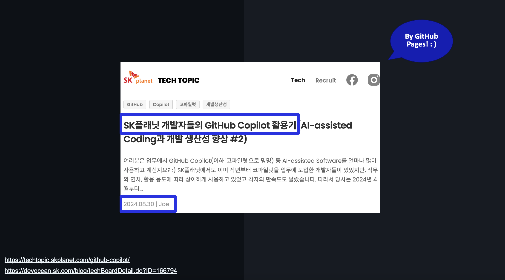

안녕하세요, SK플래닛 Joe입니다.  
2024년 12월 6일 서울 광화문에서 있었던 'Microsoft-GitHub UNIVERSE24 Recap Seoul'에 발표자로 참여한 후기를 간략히 공유해 드립니다. 이날 안과 바깥에서 모이셨던 모든 분들이 평화롭고 안전하게 귀가하셨길 진심으로 바랍니다.  

Hi, this is Joe from SK Planet. 
I’d like to briefly share my experience as a speaker at the 'Microsoft-GitHub UNIVERSE24 Recap Seoul' event held on December 6, 2024, in Gwanghwamun, Seoul. I sincerely hope that everyone who attended, both inside and outside the venue, returned home peacefully and safely that day.

こんにちは、SKプラネットのJoeです。 
2024年12月6日にソウルの光化門で開催された「Microsoft-GitHub UNIVERSE24 Recap Seoul」に発表者として参加した感想を簡単に共有させていただきます。当日、会場内外に集まったすべての方々が平和で安全に帰宅されたことを心より願っています

(Event Website: https://gh.io/universerecapkr24/ )

### 1. 발표자 섭외 (Speaker Invitation, 発表者招待)
---
저희 회사에서는 AI-assisted Coding의 효과 검증을 위해 사용자 그룹을 구성하여 GitHub Copilot Business 버전을 업무에 활용하였고, 해당 사례를 블로그로 정리하여 지난 8월 SK 데보션과 당사 Tech Topic 블로그에 포스팅하였는데요(아래). 마침 GitHub APAC의 담당자께서 이 블로그를 보시고 발표 요청 연락을 주셨습니다!

Our company formed a user group to verify the effectiveness of AI-assisted coding by utilizing the GitHub Copilot Business version in our workflow. We documented this case and posted it on SK DevOcean and our Tech Topic blog last August (links below). Subsequently, a representative from GitHub APAC saw the blog and reached out to invite us to present!

当社ではAI支援コーディングの効果を検証するために、ユーザーグループを結成し、GitHub Copilot Businessバージョンを業務に活用しました。その事例をブログにまとめ、昨年8月にSK DevOceanと当社のTech Topicブログに投稿しました（以下リンク）。その結果、GitHub APACの担当者がこのブログを見て、発表依頼の連絡をいただきました！

* SK DevOcean Tech Blog: https://devocean.sk.com/blog/techBoardDetail.do?ID=166794
* SK planet Tech Topic: https://techtopic.skplanet.com/github-copilot/

아시는 것처럼 매년 가을에는 미국 샌프란시스코에서 GitHub의 신기술을 발표하는 UNIVERSE 컨퍼런스가 열리는데요(https://githubuniverse.com/, 10월 또는 11월), 이후 서울을 포함한 전 세계 주요 도시에서 Recap 행사가 열립니다(12월 경). 
2024년 서울 행사에서 고객 사례 중 하나로 'SK플래닛의 GitHub Copilot 활용 사례'를 발표해 줄 수 있는지 연락을 주셔서 기쁘게 수락하게 되었습니다.
발표를 위해 내부 보고 등 일련의 절차를 밟았으며, GitHub에서 제공하는 예쁜 템플릿을 활용하여 발표를 준비하였습니다. 

As you may know, GitHub holds its annual UNIVERSE conference in San Francisco, USA, every fall (https://githubuniverse.com/, usually in October or November) to showcase its latest technologies. Afterward, recap events are held in major cities worldwide, including Seoul, around December. For the 2024 Seoul event, GitHub asked if we could share "SK Planet's GitHub Copilot Use Case" as one of the customer success stories, and we gladly accepted.
We went through the necessary internal reporting and approval processes and prepared the presentation using GitHub's beautifully designed templates.

ご存知のように、毎年秋にはアメリカのサンフランシスコでGitHubの最新技術を発表するUNIVERSEカンファレンスが開催されます（https://githubuniverse.com/ 、 通常は10月または11月）。その後、ソウルを含む世界中の主要都市でRecapイベントが12月頃に行われます。2024年のソウルイベントでは、「SKプラネットのGitHub Copilot活用事例」をお客様事例の一つとして発表できないかという依頼を受け、喜んで承諾しました。
発表準備のため、社内報告などの一連のプロセスを経て、GitHubが提供する美しいテンプレートを活用して準備を進めました。

(The main font of GitHub’s presentation template is 'Mona Sans.')

### 2. 발표 당일 스케치   (Sketch of the Presentation Day, 発表当日スケッチ)
--- 
연말이어서 판교에서 광화문까지 오는데 길이 꽤 막혔습니다. 
조금 늦었지만 담당 매니저께서 전혀 부담 갖지 않도록 편하게 맞아 주셨고요 :) 빔프로젝트-노트북 셋업은 별도 리허설 없이 연결상태만 간단히 확인한 후 Microsoft 및 GitHub 엔지니어 분들과 함께 도시락을 먹었습니다. 모두 좋은 분들이었고 편하게 대해 주셔서 즐거운 점심 시간을 가졌습니다. 
굿즈(티셔츠와 간식)도 따로 챙겨주셨고, 개발자용 스티커와 담요 등 참석자에게 제공하는 선물도 잘 받았습니다 :) 

Since it was the end of the year, the traffic from Pangyo to Gwanghwamun was quite heavy. Although I arrived a bit late, the manager warmly welcomed me, ensuring I felt no pressure. :) For the setup, we simply checked the connection between the projector and laptop without a separate rehearsal, then had lunch with engineers from Microsoft and GitHub. Everyone was kind and approachable, which made for an enjoyable lunchtime.
They also prepared some goodies (a T-shirt and snacks) separately for me, and I received the gifts for participants, including developer stickers and a blanket. :)

年末ということもあり、板橋（パンギョ）から光化門（クァンファムン）までの道がかなり混雑していました。少し遅れて到着しましたが、担当マネージャーが全くプレッシャーを感じないように温かく迎えてくださいました :) プロジェクターとノートPCの接続確認は簡単に状態を確認するだけでリハーサルは行わず、その後MicrosoftとGitHubのエンジニアの皆さんと一緒にお弁当をいただきました。皆さん素敵な方々で、気さくに接してくださったおかげで楽しいランチタイムを過ごすことができました。
また、グッズ（Tシャツやお菓子）も特別に用意してくださり、開発者用ステッカーやブランケットなど、参加者向けのプレゼントも受け取りました :)

(Aren't the goodies cute and lovely? ^ ^)

### 3. 행사 진행 (Event Progress, イベント進行)
--- 
행사는 크게 다음과 같이 진행되었는데요, 

* 인사말 (한국 마이크로소프트 부문장, GitHub APAC 담당자) 
* UNIVERSE에서 소개된 신기술 소개 및 데모 (DevRel 및 엔지니어)
* 국내 네임드 개발자의 발표 (아웃사이더 님)
* 고객 사례 소개 (SK플래닛 발표)

The event was organized as follows:

* Welcome remarks (Head of Microsoft Korea, GitHub APAC representative)
* Introduction and demo of new technologies presented at UNIVERSE (DevRel and engineers)
* Presentation by a prominent Korean developer (Mr. Outsider)
* Customer case study (SK Planet presentation)

イベントは以下のように進行されました：

* 挨拶（韓国マイクロソフト部門長、GitHub APAC担当者）
* UNIVERSEで紹介された新技術の紹介とデモ（DevRelおよびエンジニア）
* 国内の著名な開発者による発表（アウトサイダーさん）
* 顧客事例の紹介（SKプラネットによる発表）

이날 소개되었던 기술 정리도 함께 하고 싶은데 너무 길어질 것 같아 조금 더 여유가 생기면 한번 시도해 볼까 합니다. :)
이날 행사의 세부 주제와 연사는 여기를 참조하시기 바랍니다. 
=> https://gh.io/universerecapkr24/ 

I’d like to compile a summary of the technologies introduced during the event, but it feels like it might get too lengthy. Perhaps I’ll give it a try when I have more time towards. :)
For detailed topics and speakers from the event, please refer here: => https://gh.io/universerecapkr24/

当日紹介された技術のまとめも作成したいと思っていますが、少し長くなりそうです 、少し余裕ができたら試してみようかなと思っています）。:)
当日のイベントの詳細なテーマやスピーカーについては、こちらをご参照ください。 => https://gh.io/universerecapkr24/

### 4. 당사 발표 (SK Planet Presentation, 当社の発表)
--- 
발표의 기본적인 내용은 블로그 내용 중심으로 진행하되, 
앞 부분에 다음 내용을 추가하였습니다. 

The presentation was primarily based on the content from our blog, but we added the following sections at the beginning:

発表の基本内容はブログを中心に進めましたが、冒頭に以下の内容を追加しました：

* Microsoft-GitHub Collaboration (2022–Present)
* Recap in Recap (Summary of SK 'AI Vision')

#### Microsoft-GitHub Collaboration

2022년부터 현재까지 Microsoft-GitHub과 당사와의 인연(!) 및 협업의 여정을 한 장의 장표로 정리하였습니다. 많은 도움을 주신 양 사 담당자 분들께 이 자리를 빌어 감사를 드립니다. 

We summarized the journey and partnership between Microsoft, GitHub, and SK Planet from 2022 to the present in a single slide. I would like to take this opportunity to thank the representatives from both companies for their support.

2022年から現在まで続くMicrosoftとGitHub、そして当社のパートナーシップの歩みを1枚のスライドにまとめました。この場を借りて、両社の担当者の皆様に感謝申し上げます。

#### Recap in Recap (SK AI Vision Summary)

본 발표 내용은 SK그룹의 'AI Vision'과도 결을 같이 한다는 것을 함께 설명하였는데요, 여기서는 간략하게 지난 11월 진행된 SK AI SUMMIT 2024를 통해 SK의 AI Vision이 공유된 것과, 이와 연계된 SK그룹 구성원 대상 다양한 AI 활용역량 강화 방법(교육, 업무, 경연/프롬프톤 등)을 말씀드렸습니다. 

We highlighted how the presentation aligns with SK Group’s 'AI Vision.' This included a brief explanation of the SK AI SUMMIT 2024 held in November, where SK's AI Vision was shared, and the various ways SK Group is enhancing AI capabilities among its members (through training, work initiatives, competitions, and “Promptathons”).

この発表内容は、SKグループの「AI Vision」とも一致していることを説明しました。ここでは、11月に開催されたSK AI SUMMIT 2024を通じて共有されたSKのAI Visionと、それに関連したSKグループのメンバーを対象としたAI活用スキル向上の方法（教育、業務、競技会／プロンプトハッカソンなど）について簡単に述べました。

 

#### Copilot 활용 사례 (Use Case, 活用事例)

활용 사례의 대부분은 당사 기술 블로그의 내용과 유사합니다. 
자세한 내용은 아래를 참조하시기 바랍니다. 

Most of the use cases shared were similar to the content in our technical blog. For more details, please refer to the links below:

活用事例のほとんどは、当社の技術ブログの内容と類似しています。詳しくは、以下のリンクをご参照ください：

* https://devocean.sk.com/blog/techBoardDetail.do?ID=166794
* https://techtopic.skplanet.com/github-copilot/

 
## 마무리하며 (Wrap up, 締めくくりに)
--- 
광화문 행사에 발표자로서는 처음 참여한 세미나였는데요, 그 동안 GitHub Blog에서 단어로만 접했던 개발자의 'Happiness'를 잠시나마 느낄 수 있었던 행사였습니다.

This was my first time participating as a speaker at a seminar held in Gwanghwamun, and it was an event where I could briefly feel the developer’s "Happiness" that I had only read about in words on the GitHub Blog.

今回、光化門で開催されたセミナーに発表者として初めて参加しましたが、これまでGitHubブログで言葉としてしか見たことのなかった開発者の「Happiness」を少しだけ体感できたイベントでした。
   
블로그에서 일일이 실명을 언급하지는 못했지만, 귀한 자리에 초대해 주시고 도움을 주셨던 모든 분들께 다시 한번 감사드립니다. 
이 글을 읽으시는 모두가 행복한 2025년을 맞기를 진심으로 바랍니다. 감사합니다. 

Although I cannot mention everyone's name individually in this blog, I would like to extend my heartfelt thanks to everyone who invited me to this wonderful event and provided their support. I sincerely wish all of you reading this a joyful and prosperous 2025. Thank you.

ブログで個々のお名前を挙げることはできませんが、この素晴らしい場に招待してくださり、ご支援いただいたすべての方々に心から感謝申し上げます。このブログを読んでくださっている皆様が、幸せで実り多い2025年を迎えられることを心より願っております。ありがとうございました。

(*) 한국어 외 영어와 일본어는 기계번역을 사용하였습니다. 
The above sentence was translated into English and Japanese using machine translation. 
上記の文章は、英語と日本語に機械翻訳を使用して翻訳されました。

