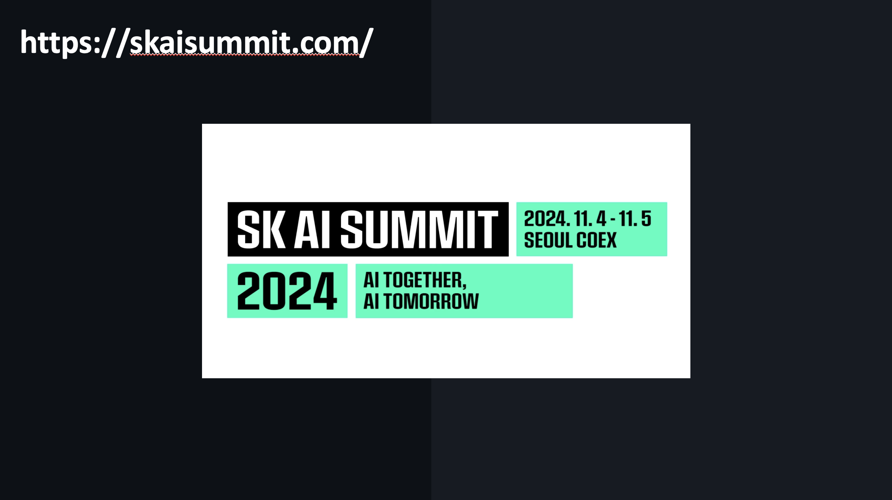

안녕하세요, SK플래닛 Joe입니다. 

2024년 12월 6일 서울 광화문에서 있었던 'Microsoft-GitHub UNIVERSE24 Recap Seoul'에 발표자로 참여한 후기를 간략히 공유해 드립니다(이날 안과 바깥에서 모이셨던 모든 분들이 평화롭고 안전하게 귀가하셨길 진심으로 바랍니다).  

(행사 사이트: https://gh.io/universerecapkr24/ )

### 1. GitHub UNIVERSE24 Recap Seoul - 발표자 섭외
---
저희 회사에서는 AI-assisted Coding의 효과 검증을 위해 사용자 그룹을 구성하여 GitHub Copilot Business 버전을 업무에 활용하였고, 해당 사례를 블로그로 정리하여 지난 8월 SK 데보션과 당사 Tech Topic 블로그에 포스팅하였는데요(아래). 마침 GitHub APAC의 담당자께서 이 블로그를 보시고 발표 요청 연락을 주셨습니다!

* SK데보션 테크 블로그: https://devocean.sk.com/blog/techBoardDetail.do?ID=166794
* SK플래닛 Tech Topic: https://techtopic.skplanet.com/github-copilot/

아시는 것처럼 매년 가을에는 미국 샌프란시스코에서 GitHub의 신기술을 발표하는 UNIVERSE 컨퍼런스가 열리는데요(https://githubuniverse.com/, 10월 또는 11월), 이후 서울을 포함한 전 세계 주요 도시에서 Recap 행사가 열립니다(12월 경). 
2024년 서울 행사에서 고객 사례 중 하나로 'SK플래닛의 GitHub Copilot 활용 사례'를 발표해 줄 수 있는지 연락을 주셔서 기쁘게 수락하게 되었습니다.

발표를 위해 내부 보고 등 일련의 절차를 밟았으며, GitHub에서 제공하는 예쁜 템플릿을 활용하여 발표를 준비하였습니다.  

(GitHub 발표 템플릿의 메인 폰트는 'Mona Sans'입니다)

### 2. 발표 당일(직전) 스케치 
--- 
연말이어서 판교에서 광화문까지 오는데 길이 꽤 막혔습니다. 
조금 늦었지만 담당 매니저께서 전혀 부담 갖지 않도록 편하게 맞아 주셨고요 :) 빔프로젝트-노트북 셋업은 별도 리허설 없이 연결상태만 간단히 확인한 후 Microsoft 및 GitHub 엔지니어 분들과 함께 도시락을 먹었습니다. 모두 좋은 분들이었고 편하게 대해 주셔서 즐거운 점심 시간을 가졌습니다. 

굿즈(티셔츠와 간식)도 따로 챙겨주셨고, 개발자용 스티커와 담요 등 참석자에게 제공하는 선물도 잘 받았습니다 :) 

(굿즈가 참 귀엽고 예쁘죠? ^ ^)

### 3. 행사 진행 
--- 
행사는 크게 다음과 같이 진행되었는데요,  

* 인사말 (한국 마이크로소프트 부문장, GitHub APAC 담당자)
* UNIVERSE에서 소개된 신기술 소개 및 데모 (DevRel 및 엔지니어)
* 국내 네임드 개발자의 발표 (아웃사이더 님)
* 고객 사례 소개 (SK플래닛 발표)

이날 소개되었던 기술 정리도 함께 하고 싶은데 너무 길어질 것 같아( ~~제가 MS나 GitHub DevRel이 되면(?)~~ ) 연말에 조금 더 여유가 생기면 한번 시도해 볼까 합니다.  

이날 행사의 세부 주제와 연사는 여기를 참조하시기 바랍니다. 
=> https://gh.io/universerecapkr24/ 

### 4. 당사 발표  
--- 
발표의 기본적인 내용은 블로그 내용 중심으로 진행하되, 
앞 부분에 다음 내용을 추가하였습니다. 

* Microsoft-GitHub Collaboration (2022년~현재)
* Recap in Recap (SK 'AI Vision' 요약)

#### Microsoft-GitHub Collaboration

2022년부터 현재까지 Microsoft-GitHub과 당사와의 인연(!) 및 협업의 여정을 한 장의 장표로 정리하였습니다. 많은 도움을 주신 양 사 담당자 분들께 이 자리를 빌어 감사를 드립니다. 

#### Recap in Recap (SK AI Vision 요약)

본 발표 내용은 SK그룹의 'AI Vision'과도 결을 같이 한다는 것을 함께 설명하였는데요, 여기서는 간략하게 지난 11월 진행된 SK AI SUMMIT 2024를 통해 SK의 AI Vision이 공유된 것과, 이와 연계된 SK그룹 구성원 대상 다양한 AI 활용역량 강화 방법(교육, 업무, 경연/프롬프톤 등)을 말씀드렸습니다. 

 

#### 코파일럿 활용 사례 

활용 사례의 대부분은 당사 기술 블로그의 내용과 유사합니다. 
자세한 내용은 아래를 참조하시기 바랍니다. 

* SK데보션 테크 블로그: https://devocean.sk.com/blog/techBoardDetail.do?ID=166794
* SK플래닛 Tech Topic: https://techtopic.skplanet.com/github-copilot/

 
## 마무리하며 
--- 
광화문 행사에 발표자로서는 처음 참여한 세미나였는데요, 그 동안 GitHub Blog에서 단어로만 접했던 개발자의 'Happiness'를 잠시나마 느낄 수 있었던 행사였습니다.  

블로그에서 일일이 실명을 언급하지는 못했지만, 귀한 자리에 초대해 주시고 도움을 주셨던 모든 분들께 다시 한번 감사드립니다. 
이 글을 읽으시는 모두가 행복한 2025년을 맞기를 진심으로 바랍니다. 감사합니다. 

