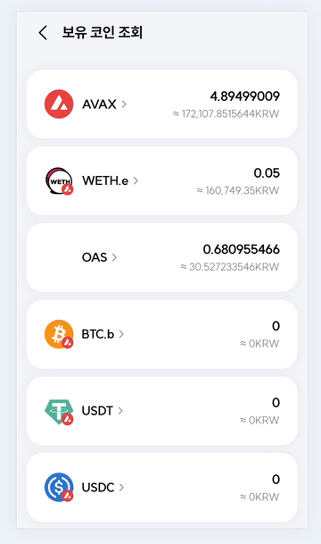
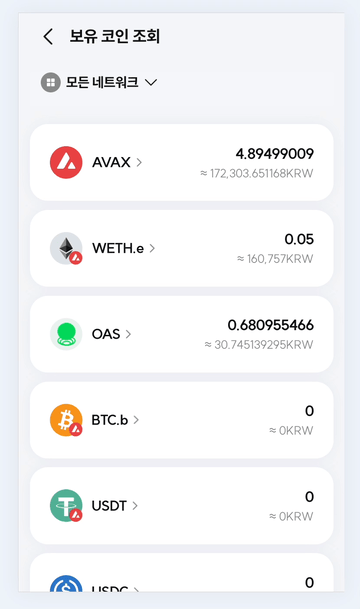
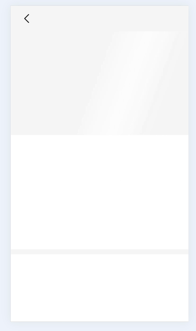
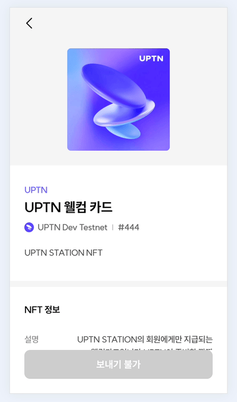
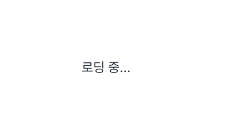
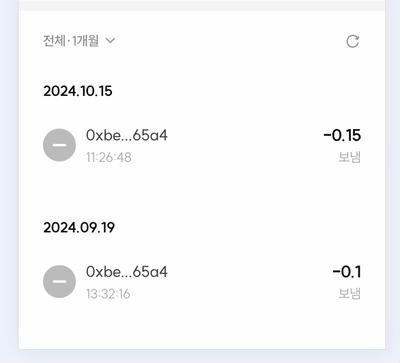
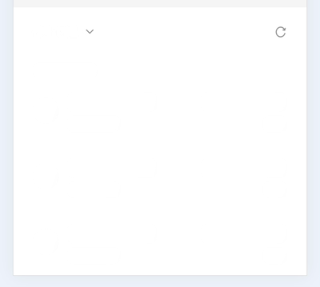
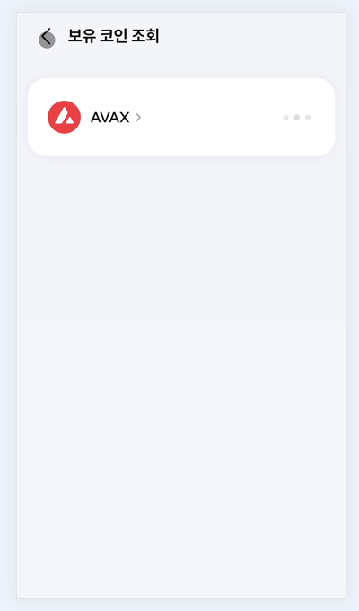
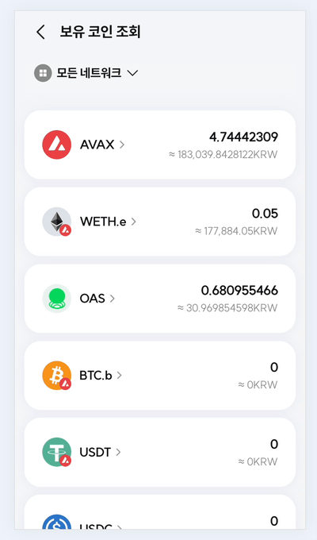

SK플래닛에서 운영하는 블록체인 플랫폼의 프론트엔드 개발을 담당하는 김찬민입니다. 저는 입사 전부터 '나부터 사용하고 싶고 네이티브 이상으로 부드러운 웹앱'을 만들고 싶은 꿈이 있었는데요, 이를 위해 작은 디테일을 잡아내는 것이 중요하다고 생각했습니다. 이번 글은 프론트엔드 개발자가 도입한 기술을 통한 사용자 경험 개선에 관한 이야기입니다.

### 스피너, 어떻게 개선할 수 있을까 

1년 전 UPTN Station을 처음 맡게 되었을 때의 기억이 아직도 생생한데요, 이 서비스가 과연 어떤 앱인지 파악하기 위해 직접 써보던 중 저는 화면을 가득 채우는 로딩 스피너가 제일 먼저 눈에 들어왔습니다.


- **AS-IS (1년 전)**



스피너는 페이지가 데이터를 불러오는 중임을 표시하는 효과적인 수단이지만, 사용자에게 어떤 화면이 나타날지를 미리 알려주지 않고 유저의 탐색 경험을 가로막는다는 점에서 좋지 않은 UI라고 생각했습니다.

덧붙여 스피너를 표시하는 것은 PHP나 JSP 등 템플릿 엔진을 기반으로 한 고전적인 홈페이지에서 데이터를 불러오는 경험과 유사하다고 느꼈는데, 우리는 SPA 기반의 웹뷰 어플리케이션을 개발하고 있는 만큼 이보다 나은 UX를 제공할 수 있어야 한다고 생각했습니다.

- **TO-BE (현재)**



동일한 화면에 스켈레톤을 적용해본 모습입니다.

단순히 로딩 중임을 알리는 스피너와 달리 스켈레톤 UI는 페이지 레이아웃과 구조를 미리 보여주어, 사용자가 어떤 정보를 보게 될지 미리 예측할 수 있도록 해줍니다.

또한 FCP를 최소화하기 위해 SSR을 도입하는 것처럼 스켈레톤 UI는 비록 실제 로딩 시간은 동일하더라도 사용자가 더 빠르게 콘텐츠를 접하고 있다는 인식을 줄 수 있다는 효과가 있습니다.

### FCP 벤치마크

```js
onMounted(() => {
  new PerformanceObserver((entryList) => {
    for (const entry of entryList.getEntriesByName("first-contentful-paint")) {
      console.log("FCP candidate:", entry.startTime, entry);
    }
  }).observe({ type: "paint", buffered: true });
});
```

```js
// 로딩 스피너 적용 시
// FCP candidate: 699.6000000238419
{
  name: 'first-contentful-paint',
  entryType: 'paint',
  startTime: 699.6000000238419, // 400 ~ 900ms 사이의 값
  duration: 0
}

// 스켈레톤 적용 시
// FCP candidate: 204.69999998807907
{
  name: 'first-contentful-paint',
  entryType: 'paint',
  startTime: 204.69999998807907, // 200ms ~ 260ms 사이의 값
  duration: 0
}
```

### 스켈레톤을 어떻게 잘 도입할 수 있을까?

그렇다고 스켈레톤이 로딩 경험을 향상시키는 은탄환이 되어 준 것은 아니었습니다.

- **중간 버전 (스켈레톤 도입 초기)**



높이가 고정되지 않은 UI와 컨텐츠의 길이를 예측할 수 없는 상황이 겹쳐 [레이아웃 시프트](https://web.dev/articles/cls?hl=ko)가 발생할 수밖에 없는 상황도 있었고, 쿼리 개수가 적어 빠르게 로딩되는 페이지에서는 오히려 스켈레톤이 화면을 갑작스럽게 변화시킨다는 느낌을 주게 되었습니다.

- **현재 (스켈레톤 대신 페이지 페이드 효과 적용)**



그래서 모든 스피너를 일괄적으로 스켈레톤으로 교체하기보다는 발생하는 네트워크 지연을 측정해, 비교적 짧은 지연이 예상되는 페이지에는 레이아웃 시프트를 발동할 염려가 없는 스피너, fade 효과 등을 대신 채택했습니다.

> 📄 이런 결정에는 카카오페이의 [무조건 스켈레톤 화면을 보여주는게 사용자 경험에 도움이 될까요?](https://tech.kakaopay.com/post/skeleton-ui-idea/) 라는 글이 많은 도움이 되었습니다.

한편, 스켈레톤이 필요할 때마다 마크업을 하는 것은 생각보다 많은 시간이 소요될 수도 있습니다.

```html
// CoinDetailSkeleton.vue

<div class="skeleton__coin-detail">
  <div class="skeleton__name-wrapper">
    <div class="skeleton__name"></div>
    <div class="skeleton__chain"></div>
  </div>
  <div class="skeleton__amount"></div>
  <!-- ... -->
</div>
```

```css
.skeleton__coin-list {
  animation: skeleton infinite;
}

.skeleton__name-wrapper {
  display: flex;
  margin-bottom: 0.8rem;
}

.skeleton__name {
  height: 8rem;
  width: 20rem;
}

.skeleton__chain {
  height: 8rem;
  width: 12rem;
}

.skeleton__amount {
  width: 34rem;
  height: 12rem;
}

/* ... 스켈레톤 스타일 코드 */
```

초기에는 위와 같은 형태로 스켈레톤을 페이지마다 구현하기도 했었는데요, 한정된 개발기간 내에 최대한의 생산성을 발휘하기 위해서는 마크업을 보다 쉽고 빠르게 마칠 수 있는 방법이 필요했습니다.

```html
// CoinDetailSkeleton.vue

<div>
  <Skeleton width="200" height="80" />
  <Spacing size="8" />
  <Row>
    <Skeleton width="340" height="120" />
    <Spacing size="8" direction="row" />
    <Skeleton width="120" height="80" />
  </Row>
</div>
```

저희는 공통으로 사용되는 애니메이션이 포함된 스켈레톤을 컴포넌트로 만들고, UI의 레이아웃을 제어하는 `<Row>`, `<Column>`, `<Spacing>` 등의 컴포넌트를 적절히 섞어 사용함으로써 스켈레톤 구현에 페이지당 약 5 ~ 10분 내외의 최소한의 시간만을 들이고 서비스 개발에 집중할 수 있었습니다.

### `<Transition>` 컴포넌트 활용하기

두 번째로 다룰 주제는 조건부 렌더링과 관련된 이야기인데요, 어려운 내용은 아니지만 잘 알려지지 않은 탓에 사용하지 않는 경우가 있는 것 같아 이번 글에서 함께 소개해보고 싶었습니다.

```html
<!-- React -->
<div>
  { service?.name ?
  <p>{service?.name}</p>
  :
  <p>로딩 중...</p>
  }
</div>

<!-- Vue -->
<div>
  <p v-if="service?.name">{{ service?.name }}</p>
  <p v-else>로딩 중...</p>
</div>
```



React 경험이 있는 FE 개발자라면 아래 로직이 익숙할 텐데요, 상태에 따른 UI가 조금 더 자연스럽게 전환될 수는 없을까요?

```html
<div>
  <Transition name="fade">
    <TransferListSkeleton v-if="transferQuery.isLoading" />
    <TransferList v-else :data="transferQuery.data" />
  </Transition>
</div>
```

```css
/* [사용자 지정 애니메이션]-[enter|leave]-[active|from|to] 의 형식에 맞게 애니메이션을 정의합니다. */
/* 전이되는 클래스명에 대한 설명은 아래 공식 문서 링크를 참고해 주세요. */
/* https://vuejs.org/guide/built-ins/transition#css-based-transitions */

.fade-leave-active {
  transition: opacity 0.2s ease;
}

.fade-enter-from,
.fade-leave-to {
  opacity: 0;
}
```

React에서는 [React-Transition-Group](https://reactcommunity.org/react-transition-group/), [Framer-motion](https://www.framer.com/motion/) 을 통해 이를 구현할 수 있지만, Vue에서는 [`<Transition>`](https://vuejs.org/guide/built-ins/transition) 이라는 내장 컴포넌트로 조건부 렌더링을 적용할 요소를 감싸는 것만으로도 간단히 동일한 효과를 구현할 수 있습니다.

- **AS-IS**



- **TO-BE**



조건부 렌더링과 관련된 한 가지 팁을 남겨보자면, 기본적으로는 A 상태에서 B 상태로 전환되어도 `<Transition>` 의 영향을 받는 하위 컴포넌트들은 애니메이션이 종료되기 전까지 DOM에 유지됩니다.

```html
<div>
  <Transition name="fade" mode="out-in">
    <!-- mode="out-in" 이 설정되면 스켈레톤이 DOM에서 제거된 후 <TransferList> 가 렌더링되는 것이 보장된다. -->
    <TransferListSkeleton v-if="transferQuery.isLoading" />
    <TransferList v-else :data="transferQuery.data" />
  </Transition>
</div>
```

즉 기본적으로는 트랜지션 애니메이션이 종료되기 전까지 DOM에 로딩 UI와 완료 UI가 동시에 존재할 수 있는데요, [mode](https://vuejs.org/guide/built-ins/transition#transition-modes) 속성을 조작해 UI가 전환되는 시점을 제어할 수 있습니다.

이처럼 `<Transition>` 을 활용하면 외부 라이브러리를 사용하지 않고도 쉽고 미려한 enter-exit 전환 애니메이션을 부여할 수 있다는 점에서 많은 분들께 추천드리고 싶습니다.

### Tanstack-Query 도입하기

마지막으로 이제는 너무나 유명해진 Tanstack-Query (TQ로 줄여 부르겠습니다) 이야기를 도입한 후기를 짧게 소개해보려 합니다.

```javascript
onMounted(() => {
  handleFetchCoinList();
});

const handleFetchCoinList = async () => {
  await useCoinDetail().load({ ...params });
  // Do something...
};
```

TQ를 도입하기 전까지는 마운트 시점에 데이터를 페칭하고, 필요한 경우에 [Pinia](https://pinia.vuejs.org/) 스토어를 활용해 페칭한 데이터를 전역으로 활용했습니다.

- **AS-IS (1년 전)**



이는 정말 기본적이면서 확실한 데이터 페칭 방법이기도 하지만 사용자는 페이지를 이동할 때마다 데이터를 새로 불러옴에 따른 지연과 로딩 UI를 반복적으로 만나야 했고, 서버 상태를 관리하기 위해 Pinia 스토어를 관리하는 로직을 별도로 작성해야 하는 점은 개발자에게도 쉽지 않아 개선이 필요하다고 생각했습니다.

- **TO-BE (현재)**



```javascript
// AS-IS
onMounted(() => {
  if (!coinStore.$state.coinList.length) {
    handleFetchCoinList();
  }
});

const handleFetchCoinList = async () => {
  const { isLoading, coinList } = await useCoinDetail().load({ ...params });
  isLoading.value = isLoading;
  coinStore.setCoinList(coinList);
};
```

```javascript
// TO-BE
import { keepPreviousData } from "@tanstack/vue-query";

const { isLoading, data: coinList } = useQuery({
  queryKey: [WALLET_COIN_LIST_API],
  queryFn: () => useCoinDetail().load({ ...params }),
  // 페이지 이동 과정에서 데이터가 갱신되어도, 데이터가 심리스하게 교체됩니다.
  placeholderData: keepPreviousData,
});
```

약 3만 명의 유저가 꾸준히 사용하는 라이브 서비스에 새로운 기술을 도입한다는 시도가 설레면서도 걱정스러웠던 경험도 있었는데요, 결과는 기대했던 것보다 훨씬 성공적이었습니다.

여러 글에서 이미 다뤘겠지만 TQ를 도입한 이후 저희도 `isLoading` 등 페칭 상태를 관리하는 로직을 작성하는 난이도가 크게 낮아졌고, 무엇보다 UX를 크게 끌어올리면서도 서버 상태 관리 난이도가 크게 높아지지 않은 점에서 만족스러운 결정이었던 것 같습니다.

한편으로는 TQ를 더 잘 다루기 위해 어떻게 해야 에러 핸들링을 더 멋지게 할 수 있을지에 대한 고민을 계속하고 있습니다.

```js
const { error: queryAError } = useQuery();
const { error: queryBError } = useQuery();
const { error: queryCError } = useQuery();

watch(
  () => [queryAError, queryBError, queryCError],
  () => {
    // 에러 핸들링 로직이 너무 길어진다... 😭
  }
);
```

### 마치며

이번 글을 통해 제가 보낸 한 해를 돌아보며 비교적 간단한 방법으로 UX를 개선하는 방법들을 소개해 보았는데요, 내년에는 더 멋진 서비스와 새로운 방법으로 다시 만나뵐 수 있길 바라겠습니다.

많은 분들께서 웹 어플리케이션은 네이티브에 비해 부드럽지 못하다고 생각하실 수도 있겠지만, 이를 따라잡고 네이티브와의 차이를 느끼지 못할 정도의 경험을 만들어내는 것이 웹 프론트엔드 개발자의 궁극적인 목표라고 생각합니다.

SK플래닛과 UPTN Station에도 많은 응원을 부탁드리며, 끝까지 읽어주셔서 감사드립니다!
