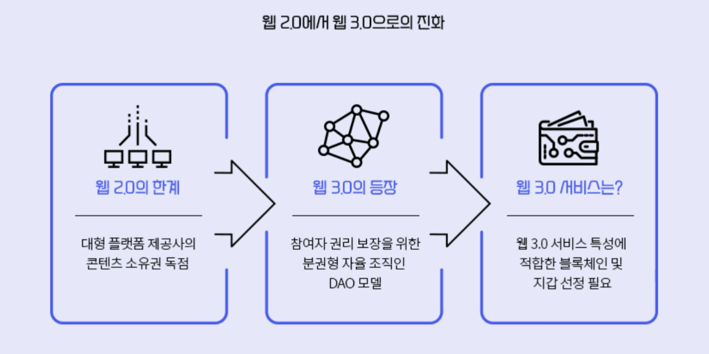

SK플래닛은 2022년부터 블록체인 기술 기반 Web3 서비스로의 진화를 위해 노력하였으며, 비즈니스와 규제 관점에서의 다양한 이슈들에 대응하며 Web3 서비스를 준비하고 있습니다.

블록체인과 Web3를 도입하는 과정에서 생태계에서 발생하는 다양한 기회와 위험을 확인할 수 있었고, 우리의 도전 이면에 잠재하고 있을 리스크에 대해서도 다시 살펴보고 평가하는 시간이었습니다.

Web3 서비스 준비 과정에서 현재 수많은 서비스들이 겪고 있는 다양한 어려움들을 파악할 수 있었으며, 이 과정을 통해 성공적인 Web3 비즈니스를 위해 필요한 서비스 레벨에 최적화된 블록체인 플랫폼의 가능성을 확인하는 기회이기도 했습니다.

### 개발자의 입장에서 바라본 Web 3.0

10여년 전 Web2.0이 회자될 때만 하더라도 다소 철학적이고 현학적인 표현이 많이 사용되었습니다.
지금 되돌아보면 결과적으로 Web2.0은 스마트폰의 시대가 열리면서, Social Media와 Public Cloud 등 새롭고 다양한 플랫폼 서비스를 통해 시장에 안착하였고, 결국 독보적인 승자들이 각각의 영역을 지배하는 모습이 되었습니다.
다시말해 Web2.0은 "사업자 중심의 플랫폼 비즈니스의 시대였다."라고 해도 무리가 없을 것 같습니다.

Web3에 대한 정의도 화자에 따라 다양하게 정의되는데, 지난 수년 간의 핫 했던 기술과 트렌드를 모두 묶어 이야기하는 경향을 보입니다.

비즈니스 관점에서 사업자 중심이 아닌 사용자에게 모든 권리를 주는 형태의 사업모델을 만드는 것은 상당한 고민이 필요한 부분일 것입니다.
이러한 어려움을 넘어 Web3를 서비스에 도입하게 될 때, 개발자의 입장에서는 우리 서비스에 이런 기술과 트렌드를 어떻게 녹여낼 수 있을까? 라는 관점에서 좀 특이한 것이 NFT 및 FT을 통한 “User Monetization” 그리고 “Decentralization” 와 같은 블록체인 특성과 관련된 요소들입니다.

국내 서비스에 Web3를 도입하려면, 완전한 탈중앙화를 통한 Web3 이상과 가치를 실현해야 한다는 주장과는 조금 거리를 두고, 개발자의 관점에서 NFT와 FT 등을 서비스에 녹여내고 적합한 영역의 서비스부터 고객이 정보와 데이터의 주도권을 가져가는 서비스를 만들 것인지를 고민해야 합니다.

따라서 블록체인과 Web3를 서비스에 적용할 때 블록체인, 지갑, 그리고 서비스에 적용하는 제약사항들을 이해할 필요가 있습니다.

### Web 3.0 서비스 도입을 위해 고려해야 할 사항들

각 블록체인은 처리속도와 처리량에 차이가 있습니다. 그리고 블록체인은 Scale-Out을 통해 성능을 높일 수 없다는 특성을 가지고 있는데, 이를 고려하여 블록체인을 선택하여야 하고, 서비스가 설계되어야 합니다.
기존 서비스에서는 트랜잭션이 실시간 처리되었고 수십 ~ 수백 ms 내 처리가 완료될 수 있었으나, 블록체인은 트랜잭션을 요청하는 시점에 성공여부를 확인할 수 없고, 아무리 빨라도 블록에 기록되었음을 확인하려면 2~3초 정도의 시간이 필요하며, 정상적인 상황에서도 10초 이상 지연될 수 있음을 고려하여 비동기 트랜잭션 기반의 서비스 설계가 필요합니다.

블록체인의 처리량을 나타내는 TPS(Transactions per Second)도 중요한 요소인데, 보다 성능을 높이기 위한 노력들이 계속되고 있으나 일반적인 이더리움 호환 가상머신을 사용하는 블록체인의 경우, 최고 사양의 노드에서 4,000 TPS 정도가 최대 용량이라는 부분도 고려하여야 합니다.

각 서비스의 회원체계는 다양한 관련 법규와 규정을 준수하기 위해 정의된 정책에 따라 설계되어 있습니다.
기존 회원 체계의 확장으로 지갑을 자체적으로 만들거나 또는 외부지갑과 연결이 필요한데, 서비스의 중앙 서버에서 사용자별 비밀키를 생성하여 지갑을 관리하는 경우 특별금융법상 이슈가 있고, 외부지갑을 연동하는 경우에는 각 서비스의 회원 정책에 따른 회원관리 연동과 본인인증 지원이 지원되어야 서비스 구현에 용이합니다.

Web3 서비스에서 NFT, FT 등의 Asset은 필수 요소이지만, 관련 법규와 규정이 준비 중인 현재 시점에서, 문제의 소지가 없는 서비스를 국내에 제공하기 위해서는 완전한 통제가 가능해야 하고, De-Fi 와 같은 외부 생태계와의 연계를 제어할 수 있어야 합니다.

### 애플리케이션 전용 블록체인의 필요성

성능과 통제가 필요한 블록체인 요구사항을 만족하기 위해서는 기존 주요 블록체인 메인넷을 직접 활용하는 것은 현실적인 문제점들이 있기 때문에, 독점적으로 사용하고, 각종 규제에 따른 제어를 위해 커스터마이징이 가능한 애플리케이션 전용 블록체인을 고려해 볼 수 있습니다.
애플리케이션 블록체인을 선택할 때, 서비스에서 필요로 하는 Web3 경제구조, 커스터마이징 지원 범위, 그리고 블록체인의 거버넌스 구조 등이 중요하게 고려해야할 기준이라고 생각됩니다.
이런 필요성을 고려하여 최근에 등장하는 블록체인들은 애플리케이션 전용 체인 기능을 지원하고 있습니다.
메인넷의 거버넌스에 종속적이지 않은 완전히 독립적인 블록체인을 개발하는 것도 생각해 볼 수 있는데, 이는 블록체인 코어 개발과 운영에 상당한 리소스가 필요하다는 점을 검토할 필요가 있습니다.

국내의 기존 서비스에서 필요로 하는 블록체인 성능과 법적 검토범위 안에서 Web3 서비스를 제공하는데 필요한 공통적인 요구사항을 독립적인 블록체인을 통해 플랫폼 레벨에서 지원하고, 변화하는 규제와 시장에 유기적으로 대응할 수 있다면, 플랫폼을 활용하는 다양한 서비스들은 보다 안정된 환경에서 비즈니스에 집중할 수 있을 것입니다.

### 마무리

블록체인 서비스 개발 과정에서 확인된 전용 체인 기반의 블록체인 플랫폼이 플랫폼으로써 면모를 갖추기 위해서는 인고의 시간과 노력이 조금 더 필요할 것입니다.
하지만 충분한 블록체인의 성능과 용량을 서비스에 제공하고, 서비스의 회원체계 및 정책과 심리스한 연결을 지원하는 지갑과 더불어 관련 법규를 충족하는 관제 기능과 외부 생태계 연계를 제어할 수 있다면, 경쟁력 있는 서비스의 빠른 Web3 도입을 지원하고, 이를 통해 가치 있는 블록체인 플랫폼의 생태계를 구축할 수 있을 것입니다.

플랫폼 내 서비스간 시너지와 동반성장을 지원하고, 추후 Web3 관련 법규와 규제 방향에 따라 온전한 모습의 Web3 생태계로 점진적이고 안정적인 확장을 주도할 수 있을 것입니다.

감사합니다.
